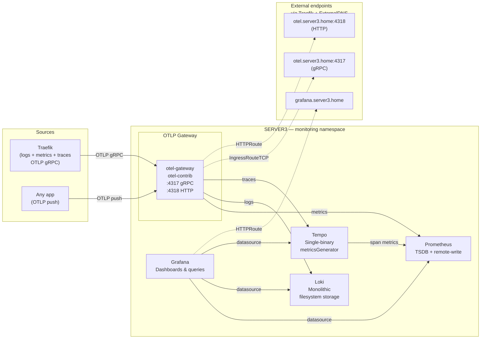

# Observability

Central LGTM stack deployed on **server3** only. Collects metrics, logs, and traces from all workloads via a single OpenTelemetry push endpoint. Grafana provides the unified query and dashboard UI.

## Architecture overview



**Push-only, no scraping.** All telemetry is pushed over OTLP. No ServiceMonitor CRDs, no Prometheus scrape configs, no kube-prometheus-stack overhead.

## Components

| Component | Chart | Version | Helm values |
|-----------|-------|---------|-------------|
| OTel Gateway | `open-telemetry/opentelemetry-collector` | 0.149.0 | [shared](../gitops/helm-values/otel-gateway.yaml) · [server3](../gitops/helm-values/server3/otel-gateway.yaml) |
| Prometheus | `prometheus-community/prometheus` | 29.2.1 | [shared](../gitops/helm-values/prometheus.yaml) · [server3](../gitops/helm-values/server3/prometheus.yaml) |
| Loki | `grafana-community/loki` | 13.2.0 | [shared](../gitops/helm-values/loki.yaml) |
| Tempo | `grafana-community/tempo` | 2.0.0 | [shared](../gitops/helm-values/tempo.yaml) |
| Grafana | `grafana-community/grafana` | 12.1.1 | [shared](../gitops/helm-values/grafana.yaml) · [server3](../gitops/helm-values/server3/grafana.yaml) |

All charts are deployed by ArgoCD. OTel Gateway is managed by [RootObservability.yaml](../gitops/argocd-manifests/RootObservability.yaml) (ApplicationSet, all clusters). The LGTM stack (Prometheus, Grafana, Loki, Tempo) is managed by [server3/RootObservability.yaml](../gitops/argocd-manifests/server3/RootObservability.yaml) (server3 only).

## Internal service addresses

| Service | ClusterIP address | Port |
|---------|-------------------|------|
| OTel Gateway (gRPC) | `otel-gateway-opentelemetry-collector.monitoring.svc.cluster.local` | 4317 |
| OTel Gateway (HTTP) | `otel-gateway-opentelemetry-collector.monitoring.svc.cluster.local` | 4318 |
| Prometheus | `prometheus.monitoring.svc.cluster.local` | 9090 |
| Loki | `loki.monitoring.svc.cluster.local` | 3100 |
| Tempo (gRPC) | `tempo.monitoring.svc.cluster.local` | 4317 |
| Tempo (HTTP) | `tempo.monitoring.svc.cluster.local` | 3200 |
| Grafana | `grafana.monitoring.svc.cluster.local` | 80 |

## OTel Gateway pipeline

The OTel Gateway (`otel-gateway` Helm release, image `otel/opentelemetry-collector-contrib`) is the single ingestion point for all telemetry.

### Processor chain

```
receivers: [otlp]
  → memory_limiter   (75% limit, 15% spike)
  → k8sattributes    (enriches: pod name, namespace, deployment, node)
  → resource         (inserts k8s.cluster.name=<cluster>)
  → batch
exporters: [...]
```

The `resource` processor is defined in the per-cluster override file (e.g. [server3/otel-gateway.yaml](../gitops/helm-values/server3/otel-gateway.yaml)) and adds a `k8s.cluster.name` attribute so all telemetry is cluster-labelled before storage.

### Fan-out routing

| Pipeline | Exporter | Destination |
|----------|----------|-------------|
| `logs` | `otlphttp/loki` | `http://loki.monitoring…:3100/otlp` |
| `traces` | `otlp/tempo` | `tempo.monitoring…:4317` (gRPC, insecure) |
| `metrics` | `prometheusremotewrite` | `http://prometheus.monitoring…:9090/api/v1/write` |

## Prometheus — TSDB only

Prometheus runs in TSDB mode with `--web.enable-remote-write-receiver`. No scraping is configured. All metrics arrive via OTel Gateway remote-write or directly from Tempo's metricsGenerator.

The Helm release is named `prometheus` and `server.fullnameOverride: prometheus` is set so the Kubernetes Service is `prometheus.monitoring.svc.cluster.local:9090` (without the default `-server` suffix).

Sub-components disabled: **alertmanager** (Prometheus's built-in alert router — routes firing alerts to email, Slack, PagerDuty, etc.; unnecessary for a homelab with no on-call), kube-state-metrics, prometheus-node-exporter, prometheus-pushgateway.

Retention: **30 days**. Storage: 20 Gi Longhorn PVC.

## Loki — Monolithic mode

Loki runs as a single binary (Monolithic deployment mode). Receives logs from OTel Gateway via OTLP HTTP on port 3100. Uses filesystem storage backed by a 20 Gi Longhorn PVC.

Auth is disabled (`auth_enabled: false`). Schema v13 (TSDB store). Self-monitoring and canary pods are disabled.

> **Note:** Loki v13.x renamed `SingleBinary` to `Monolithic` as the `deploymentMode` value. The `singleBinary:` config key still controls replica count and persistence.

## Tempo — single-binary mode

Tempo stores traces locally at `/var/tempo/traces` with a 20 Gi Longhorn PVC and a **14-day** retention (`336h`).

**metricsGenerator** is enabled. It derives RED metrics (rate, error, duration) from incoming traces and remote-writes them to Prometheus. This produces `traces_*` metric series in Prometheus, which Grafana uses for the service graph and span metrics features.

## Grafana datasources and correlations

Datasources are provisioned automatically via ConfigMaps watched by the Grafana sidecar (label `grafana_datasource: "1"`). All ConfigMaps live in [gitops/k8s-manifests/server3/grafana/](../gitops/k8s-manifests/server3/grafana/).

| Datasource | UID | URL |
|------------|-----|-----|
| Prometheus | `prometheus` | `http://prometheus.monitoring.svc.cluster.local:9090` (default) |
| Loki | `loki` | `http://loki.monitoring.svc.cluster.local:3100` |
| Tempo | `tempo` | `http://tempo.monitoring.svc.cluster.local:3200` |

### Cross-datasource correlations configured

- **Traces → Logs** (`tracesToLogsV2`): Tempo links trace IDs to Loki using the `traceID` label. Extracted from log lines via the regex `"TraceID":"(\w+)"`.
- **Traces → Metrics** (`tracesToMetrics`): Tempo links to Prometheus `traces_spanmetrics_*` series (from metricsGenerator).
- **Service graph** (`serviceMap`): Tempo service graph queries Prometheus for topology.
- **Logs → Traces** (`derivedFields`): Loki extracts `trace_id` from log lines and creates a link to the Tempo datasource.
- **Node graph**: enabled on Tempo datasource.

## Grafana admin credentials

Admin credentials are stored in OpenBao and synced to the `monitoring` namespace via ExternalSecret ([ExternalSecret.grafana.admin.yaml](../gitops/k8s-manifests/server3/grafana/ExternalSecret.grafana.admin.yaml)).

| OpenBao path | Key | Maps to |
|---|---|---|
| `secret/server3/grafana` | `admin-user` | `grafana-admin` Secret → `.admin-user` |
| `secret/server3/grafana` | `admin-password` | `grafana-admin` Secret → `.admin-password` |

Seed command (run before applying RootObservability):

```bash
bao kv put secret/server3/grafana admin-user=admin admin-password=<strong-password>
```

## Traefik integration

Traefik pushes **traces, metrics, and logs** (general + access) via OTLP gRPC to the OTel Gateway. Access log push is an experimental Traefik feature enabled via `experimental.otlpLogs: true` in the shared values.

```yaml
# gitops/helm-values/traefik.yaml  (shared — enables access logs + experimental flag)
logs:
  access:
    enabled: true
experimental:
  otlpLogs: true

# gitops/helm-values/server3/traefik.yaml  (cluster — sets OTLP endpoints)
logs:
  general:
    otlp:
      grpc:
        endpoint: "otel-gateway-opentelemetry-collector.monitoring.svc.cluster.local:4317"
        insecure: true
  access:
    otlp:
      grpc:
        endpoint: "otel-gateway-opentelemetry-collector.monitoring.svc.cluster.local:4317"
        insecure: true

tracing:
  otlp:
    grpc:
      endpoint: "otel-gateway-opentelemetry-collector.monitoring.svc.cluster.local:4317"
      insecure: true

metrics:
  otlp:
    addEntryPointsLabels: true
    addRoutersLabels: true
    addServicesLabels: true
    grpc:
      endpoint: "otel-gateway-opentelemetry-collector.monitoring.svc.cluster.local:4317"
      insecure: true
```

- **Traces** appear in Tempo and are linked to application-level spans via the `traceparent` header.
- **Metrics** (per-entrypoint, per-router, per-service) appear in Prometheus under the `traefik_*` namespace.
- **Logs** (general + access) appear in Loki. Access log push requires `experimental.otlpLogs: true`, which is set in the shared values.

## Sending telemetry from an application

### From server1 / server2 (external)

Two external endpoints are exposed via Traefik on server3:

| Protocol | Endpoint | Traefik route |
|----------|----------|---------------|
| OTLP HTTP | `http://otel.server3.home` | HTTPRoute (Traefik port 80) → backend port 4318 |
| OTLP gRPC | `otel.server3.home:4317` | IngressRouteTCP → backend port 4317 |

The gRPC endpoint uses raw TCP passthrough (`HostSNI(*)`), so no TLS is required from the client.

### From server3 (in-cluster)

Use the ClusterIP address directly — no Traefik hop needed:

```
OTLP HTTP:  http://otel-gateway-opentelemetry-collector.monitoring.svc.cluster.local:4318
OTLP gRPC:  otel-gateway-opentelemetry-collector.monitoring.svc.cluster.local:4317
```

All three signal types (metrics, logs, traces) are accepted on both endpoints.

## Helm values — two-layer structure

```
gitops/helm-values/<app>.yaml            ← shared base (all clusters)
gitops/helm-values/server3/<app>.yaml    ← server3 overrides (merged last, wins)
```

The OTel Gateway shared base defines receivers, processors, and pipeline topology. Exporters (endpoint URLs) and the `k8s.cluster.name` resource attribute are fully cluster-specific and live in each cluster's override file. LGTM backend apps (Prometheus, Grafana, Loki, Tempo) currently run only on server3.

## ArgoCD deployment structure

```
gitops/argocd-manifests/
  RootObservability.yaml                       ← App-of-Apps for all clusters (apply once)
  apps/observability/
    OTelGateway.yaml                           ← opentelemetry-collector chart + HTTPRoute + IngressRouteTCP (AppSet)
  server3/
    RootObservability.yaml                     ← App-of-Apps for server3 LGTM stack (apply once)
    apps/observability/
      Prometheus.yaml                          ← prometheus chart
      Loki.yaml                                ← loki chart
      Tempo.yaml                               ← tempo chart
      Grafana.yaml                             ← grafana chart + ExternalSecret + datasource ConfigMaps + HTTPRoute
```

Sync-waves inside each Application guarantee ordering:
- wave `-50`: ExternalSecret + datasource ConfigMaps (must exist before Grafana starts)
- wave `100`: HTTPRoutes + IngressRouteTCP (Traefik must be running before routes bind)

## Deploying / bootstrapping

1. Seed the Grafana admin secret in OpenBao (see above).
2. Ensure Traefik is running (RootGateway must be applied first).
3. Apply the multi-cluster root Application (OTel Gateway):

```bash
kubectl apply -f gitops/argocd-manifests/RootObservability.yaml
```

4. Apply the server3 LGTM stack:

```bash
kubectl apply -f gitops/argocd-manifests/server3/RootObservability.yaml
```

ArgoCD auto-syncs all four server3 Applications from that point on.

## Design decisions

### Why no kube-prometheus-stack?

kube-prometheus-stack bundles Prometheus Operator, Alertmanager, node-exporter, kube-state-metrics, and dozens of default alerting rules. For a homelab with no on-call requirements and a push-only pipeline, this is unnecessary complexity. The standalone `prometheus-community/prometheus` chart gives a bare TSDB without the operator machinery.

### Why push-only (no scraping)?

Scraping requires Prometheus to discover and reach every pod. With OTel as the single telemetry pipeline, all signal types use the same path: app → OTel Gateway → backend. No ServiceMonitor CRDs, no scrape configs to maintain, no firewall rules for Prometheus to reach remote clusters.

### Why OTel Gateway instead of per-app direct export?

A central gateway decouples apps from backend addresses. Switching backends, adding pipelines (e.g. routing errors to a dedicated backend), or enriching attributes (cluster name, environment) happens in one place without redeploying apps. Traefik and all future apps just point to `otel.server3.home` on either `:4317` (gRPC) or `:4318` (HTTP).

### Why server3 only (not multi-cluster)?

The LGTM stack is intentionally centralised. All clusters push telemetry to server3 over the LAN. Running Prometheus/Loki/Tempo replicas on every cluster would fragment data and multiply storage requirements. Future multi-cluster support (e.g. Thanos, Grafana Alloy agents) can be added incrementally without restructuring the current single-hub design.
