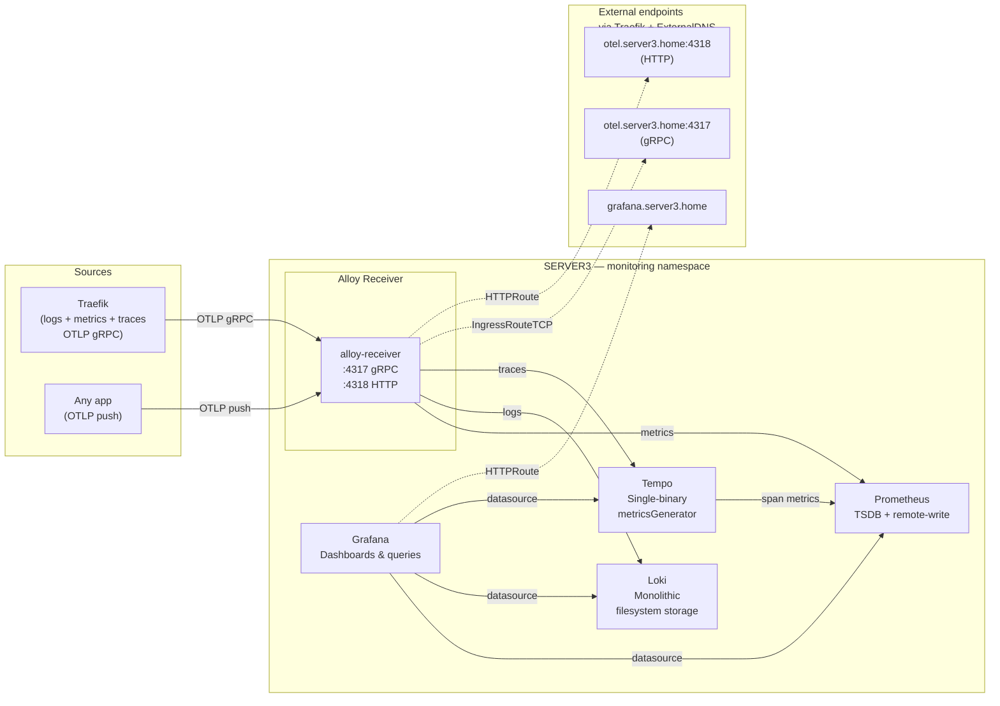

# Observability

Central LGTM stack deployed on **server3** only. Collects metrics, logs, and traces from all workloads via a single OpenTelemetry push endpoint. Grafana provides the unified query and dashboard UI.

## Architecture overview


```mermaid
graph LR
    subgraph Sources["Sources"]
        Traefik["Traefik<br/>(logs + metrics + traces<br/>OTLP gRPC)"]
        Apps["Any app<br/>(OTLP push)"]
    end

    subgraph Server3["SERVER3 — monitoring namespace"]
        subgraph Gateway["Alloy Receiver"]
            Alloy["alloy-receiver<br/>:4317 gRPC<br/>:4318 HTTP"]
        end
        
        Prometheus["Prometheus<br/>TSDB + remote-write"]
        Loki["Loki<br/>Monolithic<br/>filesystem storage"]
        Tempo["Tempo<br/>Single-binary<br/>metricsGenerator"]
        Grafana["Grafana<br/>Dashboards & queries"]
    end

    subgraph External["External endpoints<br/>via Traefik + ExternalDNS"]
        OTelGrpc["otel.server3.home:4317<br/>(gRPC)"]
        OTelHttp["otel.server3.home:4318<br/>(HTTP)"]
        GrafanaExt["grafana.server3.home"]
    end

    Traefik -->|OTLP gRPC| Alloy
    Apps -->|OTLP push| Alloy
    
    Alloy -->|metrics| Prometheus
    Alloy -->|logs| Loki
    Alloy -->|traces| Tempo
    
    Tempo -->|span metrics| Prometheus
    
    Grafana -->|datasource| Prometheus
    Grafana -->|datasource| Loki
    Grafana -->|datasource| Tempo
    
    Alloy -.->|IngressRouteTCP| OTelGrpc
    Alloy -.->|HTTPRoute| OTelHttp
    Grafana -.->|HTTPRoute| GrafanaExt
```

**Prometheus never scrapes.** Apps push OTLP to `alloy-receiver`; infrastructure metrics are scraped locally by the same Alloy collector on each cluster. Everything reaches server3 over a single outbound path per cluster — no kube-prometheus-stack, no Prometheus scrape configs.

## Components

| Component | Chart | Version location | Helm values |
|-----------|-------|------------------|-------------|
| k8s-monitoring (Grafana Alloy) | `grafana/k8s-monitoring` | [`apps/observability/K8sMonitoring.yaml`](../gitops/argocd-manifests/apps/observability/K8sMonitoring.yaml) `targetRevision` | [shared](../gitops/helm-values/k8s-monitoring.yaml) · [server1](../gitops/helm-values/server1/k8s-monitoring.yaml) · [server2](../gitops/helm-values/server2/k8s-monitoring.yaml) · [server3](../gitops/helm-values/server3/k8s-monitoring.yaml) |
| Prometheus | `prometheus-community/prometheus` | [`server3/apps/observability/Prometheus.yaml`](../gitops/argocd-manifests/server3/apps/observability/Prometheus.yaml) `targetRevision` | [shared](../gitops/helm-values/prometheus.yaml) · [server3](../gitops/helm-values/server3/prometheus.yaml) |
| Loki | `grafana-community/loki` | [`server3/apps/observability/Loki.yaml`](../gitops/argocd-manifests/server3/apps/observability/Loki.yaml) `targetRevision` | [shared](../gitops/helm-values/loki.yaml) |
| Tempo | `grafana-community/tempo` | [`server3/apps/observability/Tempo.yaml`](../gitops/argocd-manifests/server3/apps/observability/Tempo.yaml) `targetRevision` | [shared](../gitops/helm-values/tempo.yaml) |
| Grafana | `grafana-community/grafana` | [`server3/apps/observability/Grafana.yaml`](../gitops/argocd-manifests/server3/apps/observability/Grafana.yaml) `targetRevision` | [shared](../gitops/helm-values/grafana.yaml) · [server3](../gitops/helm-values/server3/grafana.yaml) |

All charts are deployed by ArgoCD. k8s-monitoring runs on all clusters (managed by the `K8sMonitoring` ApplicationSet under [`roots/RootObservability.yaml`](../gitops/argocd-manifests/roots/RootObservability.yaml)). The LGTM stack (Prometheus, Grafana, Loki, Tempo) is server3-only, managed by [`roots/server3/RootObservability.yaml`](../gitops/argocd-manifests/roots/server3/RootObservability.yaml).

## Internal service addresses

| Service | ClusterIP address | Port |
|---------|-------------------|------|
| Alloy Receiver (gRPC) | `k8s-monitoring-alloy-receiver.monitoring.svc.cluster.local` | 4317 |
| Alloy Receiver (HTTP) | `k8s-monitoring-alloy-receiver.monitoring.svc.cluster.local` | 4318 |
| Prometheus | `prometheus.monitoring.svc.cluster.local` | 80 |
| Loki | `loki.monitoring.svc.cluster.local` | 3100 |
| Tempo (gRPC) | `tempo.monitoring.svc.cluster.local` | 4317 |
| Tempo (HTTP) | `tempo.monitoring.svc.cluster.local` | 3200 |
| Grafana | `grafana.monitoring.svc.cluster.local` | 80 |

## k8s-monitoring signal flow

The `k8s-monitoring` Helm chart deploys Grafana Alloy as the single telemetry ingestion layer. The `alloy-receiver` DaemonSet accepts inbound OTLP from applications and remote clusters, and also handles all local scraping and log collection.

### Collectors — one collapsed instance

Chart v4 removed the built-in named Alloy instances. Collectors are declared under `collectors:` in the shared base, and each feature names the one it runs on. The chart's default layout is **four** collectors, one per role. This repo collapses them into **one**, which is safe only because every cluster is single-node.

| Collector | Presets | Features assigned |
|-----------|---------|-------------------|
| `alloy-receiver` (DaemonSet) | `daemonset`, `filesystem-log-reader`, `otel-receiver`, `clustered` | `applicationObservability`, `clusterMetrics`, `hostMetrics`, `clusterEvents`, `podLogsViaLoki` |

Collapsing loses no telemetry — identical features, scrapes, and data, just one Alloy process instead of four.

It keeps the name `alloy-receiver` on purpose. The Service is `k8s-monitoring-alloy-receiver`, referenced by every app's OTLP URL, [traefik.yaml](../gitops/helm-values/traefik.yaml), the HTTPRoute, and the IngressRouteTCP. Keeping the name means the OTLP endpoint is a stable contract whether the collectors are collapsed or split.

`clusterMetrics` requires the `clustered` preset — the chart refuses to render without it. At one replica it is a no-op.

#### Going multi-node: split the collectors back

The four-way split exists for reasons that apply **only** to multi-node clusters:

| Role | Why the chart splits it | Why it's moot on one node |
|------|-------------------------|---------------------------|
| logs | DaemonSet, reads local `/var/log` | DaemonSet == 1 pod |
| metrics | clustering shards scrape targets across replicas | nothing to shard |
| singleton | >1 replica duplicates k8s events | only ever 1 replica |
| receiver | scales independently with ingest volume | ingest is small |

Adding a second node to any cluster **without splitting** causes: k8s events emitted once per node (N duplicates in Loki), duplicated scrape targets, and a single OOM taking out all telemetry at once. The exact replacement block is in the header comment of [gitops/helm-values/k8s-monitoring.yaml](../gitops/helm-values/k8s-monitoring.yaml).

### Pod logs — Loki pipeline, not OpenTelemetry

Chart v4 split pod-log collection into `podLogsViaLoki` and `podLogsViaOpenTelemetry`. This repo uses `podLogsViaLoki` on **all** clusters: the OpenTelemetry variant needs `otelcol.receiver.filelog`, which is still public-preview in Alloy and requires lowering the collector's `stabilityLevel`. On server1/server2 the Loki-format logs are bridged into the OTLP destination automatically via `otelcol.receiver.loki`, so nothing is lost.

### Supplemental telemetry services

Chart v4 moved kube-state-metrics and node-exporter into the `telemetryServices` subchart, where every service defaults to `deploy: false`. Both are enabled in the shared base — `clusterMetrics` needs kube-state-metrics and `hostMetrics` needs node-exporter. `windows-exporter` stays off (all nodes are Talos Linux).

### server3 fan-out routing (local)

| Signal | Destination |
|--------|-------------|
| metrics | `http://prometheus.monitoring…:80/api/v1/write` |
| logs | `http://loki.monitoring…:3100/loki/api/v1/push` |
| traces | `tempo.monitoring…:4317` (OTLP gRPC) |

### server1/server2 forwarding (OTLP to server3)

All signals are forwarded via a single OTLP destination to `otel.server3.home:4317` with a bearer token header. On server1/server2 the `otel-auth-token` ExternalSecret syncs the token from OpenBao, and `collectorCommon.alloy.envFrom` injects it into all four collectors as `OTEL_AUTH_TOKEN`. The destination reads it with `auth.bearerTokenFrom: env("OTEL_AUTH_TOKEN")`.

> Do **not** set `secret.create` / `secret.name` on the destination instead. That switches it to the chart's "external secret" mode, which emits `remote.kubernetes.secret` lookups for every key the destination type supports (`tenantId`, `ca`, `cert`, `key`) — none of which exist in `otel-auth-token`, so Alloy fails to load its config.

> **Auth caveat:** the previous otel-gateway validated this token server-side via the OTel `bearertokenauth` extension. `k8s-monitoring` exposes no server-side OTLP auth, so server3's `alloy-receiver` accepts the token without checking it. The endpoint is protected by private-network isolation only. Adding Traefik ForwardAuth in front of `alloy-receiver` is the follow-up if real validation is needed.

## Prometheus — TSDB only

Prometheus runs in TSDB mode with `--web.enable-remote-write-receiver`. No scraping is configured. All metrics arrive via Alloy remote-write or directly from Tempo's metricsGenerator.

The Helm release is named `prometheus` and `server.fullnameOverride: prometheus` is set so the Kubernetes Service is `prometheus.monitoring.svc.cluster.local:9090` (without the default `-server` suffix).

Sub-components disabled: **alertmanager** (Prometheus's built-in alert router — routes firing alerts to email, Slack, PagerDuty, etc.; unnecessary for a homelab with no on-call), kube-state-metrics, prometheus-node-exporter, prometheus-pushgateway.

Retention: **30 days**. Storage: 20 Gi Longhorn PVC.

## Loki — Monolithic mode

Loki runs as a single binary (Monolithic deployment mode). Receives logs from Alloy via the native push API on port 3100 (`/loki/api/v1/push`). Uses filesystem storage backed by a 20 Gi Longhorn PVC.

Auth is disabled (`auth_enabled: false`). Schema v13 (TSDB store). Self-monitoring and canary pods are disabled.

> **Note:** Loki v13.x renamed `SingleBinary` to `Monolithic` as the `deploymentMode` value. The `singleBinary:` config key still controls replica count and persistence.

## Tempo — single-binary mode

Tempo stores traces locally at `/var/tempo/traces` with a 20 Gi Longhorn PVC and a **14-day** retention (`336h`).

**metricsGenerator** is enabled. It derives RED metrics (rate, error, duration) from incoming traces and remote-writes them to Prometheus. This produces `traces_*` metric series in Prometheus, which Grafana uses for the service graph and span metrics features.

## Grafana datasources and correlations

Datasources are provisioned automatically via ConfigMaps watched by the Grafana sidecar (label `grafana_datasource: "1"`). All ConfigMaps live in [gitops/k8s-manifests/server3/grafana/](../gitops/k8s-manifests/server3/grafana/). Pre-shipped dashboards (label `grafana_dashboard: "1"`) are also loaded from the same directory — currently [`ConfigMap.grafana.dashboard.traefik-opentelemetry.yaml`](../gitops/k8s-manifests/server3/grafana/ConfigMap.grafana.dashboard.traefik-opentelemetry.yaml).

| Datasource | UID | URL |
|------------|-----|-----|
| Prometheus | `prometheus` | `http://prometheus.monitoring.svc.cluster.local` (port 80, default) |
| Loki | `loki` | `http://loki.monitoring.svc.cluster.local:3100` |
| Tempo | `tempo` | `http://tempo.monitoring.svc.cluster.local:3200` |

### Cross-datasource correlations configured

- **Traces → Logs** (`tracesToLogsV2`): Tempo links trace IDs to Loki using the `traceID` label. Extracted from log lines via the regex `"TraceID":"(\w+)"`.
- **Traces → Metrics** (`tracesToMetrics`): Tempo links to Prometheus `traces_spanmetrics_*` series (from metricsGenerator).
- **Service graph** (`serviceMap`): Tempo service graph queries Prometheus for topology.
- **Logs → Traces** (`derivedFields`): Loki extracts `trace_id` from log lines and creates a link to the Tempo datasource.
- **Node graph**: enabled on Tempo datasource.

## Grafana admin credentials

Admin credentials are stored in OpenBao and synced to the `monitoring` namespace via ExternalSecret ([ExternalSecret.grafana.admin.yaml](../gitops/k8s-manifests/server3/grafana/ExternalSecret.grafana.admin.yaml)).

| OpenBao path | Key | Maps to |
|---|---|---|
| `secret/server3/grafana` | `admin-user` | `grafana-admin` Secret → `.admin-user` |
| `secret/server3/grafana` | `admin-password` | `grafana-admin` Secret → `.admin-password` |

Seed command (run before applying RootObservability):

```bash
bao kv put secret/server3/grafana admin-user=admin admin-password=<strong-password>
```

## Traefik integration

Traefik pushes **traces and metrics** via OTLP gRPC to `alloy-receiver`. Logs are no longer pushed over OTLP — Traefik writes them to stdout and Alloy collects them via `podLogsViaLoki`, so `logs.*.otlp` and `experimental.otlpLogs` were removed.

```yaml
# gitops/helm-values/traefik.yaml  (shared — all clusters)
logs:
  general:
    level: INFO
  access:
    enabled: true

tracing:
  otlp:
    grpc:
      endpoint: "k8s-monitoring-alloy-receiver.monitoring.svc.cluster.local:4317"
      insecure: true

metrics:
  otlp:
    addEntryPointsLabels: true
    addRoutersLabels: true
    addServicesLabels: true
    grpc:
      endpoint: "k8s-monitoring-alloy-receiver.monitoring.svc.cluster.local:4317"
      insecure: true
```

- **Traces** appear in Tempo and are linked to application-level spans via the `traceparent` header.
- **Metrics** (per-entrypoint, per-router, per-service) appear in Prometheus under the `traefik_*` namespace.
- **Logs** (general + access) appear in Loki via Alloy pod-log collection — no Traefik-side OTLP config required.

## Sending telemetry from an application

### From server1 / server2 (external)

Two external endpoints are exposed via Traefik on server3:

| Protocol | Endpoint | Traefik route |
|----------|----------|---------------|
| OTLP HTTP | `http://otel.server3.home` | HTTPRoute (Traefik port 80) → backend port 4318 |
| OTLP gRPC | `otel.server3.home:4317` | IngressRouteTCP → backend port 4317 |

The gRPC endpoint uses raw TCP passthrough (`HostSNI(*)`), so no TLS is required from the client.

### From server3 (in-cluster)

Use the ClusterIP address directly — no Traefik hop needed:

```
OTLP HTTP:  http://k8s-monitoring-alloy-receiver.monitoring.svc.cluster.local:4318
OTLP gRPC:  k8s-monitoring-alloy-receiver.monitoring.svc.cluster.local:4317
```

All three signal types (metrics, logs, traces) are accepted on both endpoints.

### Custom apps push metrics and traces only — not logs

The Node.js APIs set `otel.logs.enabled: false` in their config templates. Their Winston logger already writes to stdout, and Alloy ships that to Loki via `podLogsViaLoki` — pushing over OTLP as well would store every line twice.

Three reasons stdout is the primary path:

1. **`kubectl logs` keeps working.** Routing logs OTLP-only would leave `kubectl logs <pod>` empty except for crash output, forcing every debugging session through Grafana.
2. **Crash coverage.** OTLP export loses anything emitted before the exporter initializes, plus OOMKills, unhandled exceptions at exit, and whatever sits in the batch buffer when a pod is killed. The kubelet writes pod logs to disk, so they survive all of it — including an Alloy outage.
3. **No duplication.** One pipeline, one copy of each line.

The tradeoff: **OTel Resource attributes do not reach stdout.** `@opentelemetry/instrumentation-winston` injects `trace_id`/`span_id`/`trace_flags` into the Winston record itself (so those *are* on stdout), but `service.name`, `service.version`, `process.*`, `host.*` and `telemetry.sdk.*` come from the LoggerProvider's Resource and are attached only to the exported OTLP payload. Traces and metrics still carry the full Resource — this affects logs alone.

#### Open items (deferred)

**1. Restore resource attributes as Loki labels.** No chart change needed — the rendered pod-logs pipeline already contains a generic labelmap:

```
rule {
  action = "labelmap"
  regex = "__meta_kubernetes_pod_annotation_resource_opentelemetry_io_(.+)"
}
```

Any `resource.opentelemetry.io/*` pod annotation becomes a Loki label, and the `service_name` detection chain checks `resource.opentelemetry.io/service.name` before falling back to the `app.kubernetes.io/name` label and then the container name. So this is purely additive on the app side:

```yaml
podAnnotations:
  resource.opentelemetry.io/service.name: qr-manager-api
  resource.opentelemetry.io/service.version: "0.2.1"
  resource.opentelemetry.io/service.namespace: iot
```

`service.version` is worth templating from `image.tag` in the iot-applications chart rather than maintaining by hand.

**2. Trace↔log correlation and level filtering.** Pod logs are stored verbatim with no JSON parsing, so Winston JSON lands in Loki as a raw string — queryable with `| json` at read time, but `level` and `trace_id` are not labels or structured metadata. Fixed by adding to `podLogsViaLoki`:

```yaml
extraLogProcessingStages: |-
  stage.json {
    expressions = { level = "level", trace_id = "trace_id", span_id = "span_id" }
  }
structuredMetadata:
  level: level
  trace_id: trace_id
  span_id: span_id
```

`stage.json` extracts nothing and passes the line through unchanged when it isn't JSON, so plain-text startup banners and stack traces are safe.

To opt a specific workload out of pod-log collection instead (for example if it does push OTLP logs), annotate the pod — the chart's drop rule applies regardless of `discoveryMethod`:

```yaml
podAnnotations:
  logs.grafana.com/pods.enabled: "false"
```

## Helm values — two-layer structure

```
gitops/helm-values/k8s-monitoring.yaml           ← shared base: feature toggles, no destinations
gitops/helm-values/<cluster>/k8s-monitoring.yaml ← cluster name + destinations
```

Both files are applied on every cluster. The shared base carries only the feature toggles (`clusterMetrics`, `hostMetrics`, `podLogs`, `clusterEvents`, `applicationObservability`) and the four Alloy collector roles — never a `destinations` entry, since those are entirely cluster-specific. LGTM backend apps (Prometheus, Grafana, Loki, Tempo) run only on server3.

## ArgoCD deployment structure

```
gitops/argocd-manifests/
  roots/
    RootObservability.yaml                     ← sync-wave "3" — App-of-Apps for all clusters
    server3/
      RootObservability.yaml                   ← sync-wave "3" — App-of-Apps for server3 LGTM stack
  apps/observability/
    K8sMonitoring.yaml                         ← k8s-monitoring chart + k8s-manifests/<cluster>/k8s-monitoring (AppSet, all clusters)
  server3/apps/observability/
    Prometheus.yaml                            ← prometheus chart
    Loki.yaml                                  ← loki chart
    Tempo.yaml                                 ← tempo chart
    Grafana.yaml                               ← grafana chart + ExternalSecret + datasource ConfigMaps + HTTPRoute
```

Both Root Applications are discovered by the meta [`Bootstrap.yaml`](../gitops/argocd-manifests/Bootstrap.yaml) (`directory.recurse: true` over `roots/`). No manual `kubectl apply` of Root Applications — the single `Bootstrap.yaml` apply on server3 owns them.

Sync-waves inside each Application guarantee ordering:
- wave `-50`: ExternalSecret + datasource ConfigMaps (must exist before Grafana starts)
- wave `100`: HTTPRoutes + IngressRouteTCP (Traefik must be running before routes bind)

## Deploying / bootstrapping

Handled end-to-end by the server3 Bootstrap flow — no observability-specific manual steps beyond seeding secrets.

Prerequisites before the `RootObservability` waves sync:

1. Seed Grafana admin secret: `bao kv put secret/server3/grafana admin-user=admin admin-password=<…>` (see [secrets.md](secrets.md)).
2. Seed shared OTLP bearer token: `bao kv put secret/otel-gateway/auth-token token=$(openssl rand -base64 32 | tr -d '=+/')`. server1/server2 k8s-monitoring reads this path via ESO into the `otel-auth-token` secret; server3 does not need it. Their ESO policies must include a read grant for `secret/otel-gateway/*` (see [iac.md](iac.md) step 3.d).
3. Ensure `RootGateway` (wave 2) has finished — Traefik is up so HTTPRoutes bind.

After that, `RootObservability` and `server3/RootObservability` sync automatically in wave 3 via `Bootstrap.yaml`. No standalone applies.

## Design decisions

### Why no kube-prometheus-stack?

kube-prometheus-stack bundles Prometheus Operator, Alertmanager, node-exporter, kube-state-metrics, and dozens of default alerting rules. For a homelab with no on-call requirements and a push-only pipeline, this is unnecessary complexity. The standalone `prometheus-community/prometheus` chart gives a bare TSDB without the operator machinery.

### Why Prometheus never scrapes directly

Prometheus itself has no scrape configs and no network path to remote clusters. Scraping is done **locally on each cluster by Alloy** (kube-state-metrics, node-exporter, ServiceMonitor/PodMonitor discovery), which then remote-writes into Prometheus on server3. Apps still push OTLP to `alloy-receiver`. Everything reaches Prometheus over a single outbound path per cluster — no firewall rules for Prometheus to reach back into server1/server2.

### Why k8s-monitoring instead of a standalone OTel Collector?

The `grafana/k8s-monitoring` chart deploys Grafana Alloy with pre-built configurations for cluster metrics, host metrics, pod logs, cluster events, and OTLP reception. This replaces both the otel-gateway (central OTLP ingestion) and the per-namespace Apps OTel Collector forwarders with a single chart deployment per cluster. Infrastructure telemetry (node/pod metrics, logs, events) comes for free without additional configuration.

### Why server3 only (not multi-cluster)?

The LGTM stack is intentionally centralised. All clusters push telemetry to server3 over the LAN. Running Prometheus/Loki/Tempo replicas on every cluster would fragment data and multiply storage requirements. Future multi-cluster support (e.g. Thanos, Grafana Alloy agents) can be added incrementally without restructuring the current single-hub design.
