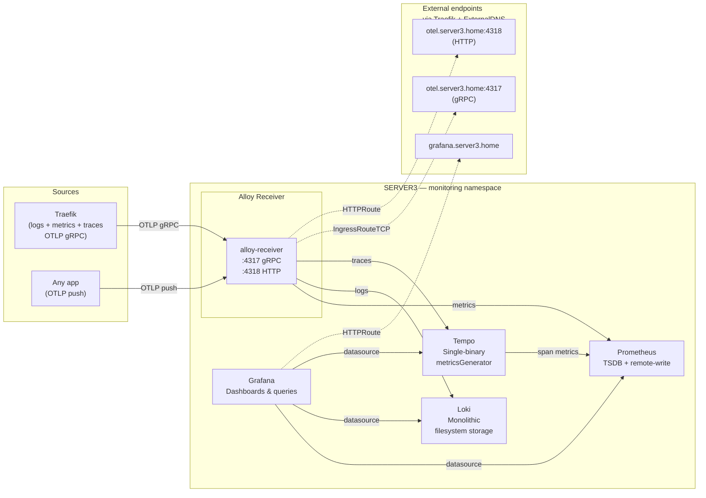

# Observability

Central LGTM stack deployed on **server3** only. Collects metrics, logs, and traces from all workloads via a single OpenTelemetry push endpoint. Grafana provides the unified query and dashboard UI.

## Architecture overview


```mermaid
graph LR
    subgraph Sources["Sources"]
        Traefik["Traefik<br/>(logs + metrics + traces<br/>OTLP gRPC)"]
        Apps["Any app<br/>(OTLP push)"]
    end

    subgraph Server3["SERVER3 — monitoring namespace"]
        subgraph Gateway["Alloy Receiver"]
            Alloy["alloy-receiver<br/>:4317 gRPC<br/>:4318 HTTP"]
        end
        
        Prometheus["Prometheus<br/>TSDB + remote-write"]
        Loki["Loki<br/>Monolithic<br/>filesystem storage"]
        Tempo["Tempo<br/>Single-binary<br/>metricsGenerator"]
        Grafana["Grafana<br/>Dashboards & queries"]
    end

    subgraph External["External endpoints<br/>via Traefik + ExternalDNS"]
        OTelGrpc["otel.server3.home:4317<br/>(gRPC)"]
        OTelHttp["otel.server3.home:4318<br/>(HTTP)"]
        GrafanaExt["grafana.server3.home"]
    end

    Traefik -->|OTLP gRPC| Alloy
    Apps -->|OTLP push| Alloy
    
    Alloy -->|metrics| Prometheus
    Alloy -->|logs| Loki
    Alloy -->|traces| Tempo
    
    Tempo -->|span metrics| Prometheus
    
    Grafana -->|datasource| Prometheus
    Grafana -->|datasource| Loki
    Grafana -->|datasource| Tempo
    
    Alloy -.->|IngressRouteTCP| OTelGrpc
    Alloy -.->|HTTPRoute| OTelHttp
    Grafana -.->|HTTPRoute| GrafanaExt
```

**Prometheus never scrapes.** Apps push OTLP to `alloy-receiver`; infrastructure metrics are scraped locally by the same Alloy collector on each cluster. Everything reaches server3 over a single outbound path per cluster — no kube-prometheus-stack, no Prometheus scrape configs.

## Components

| Component | Chart | Version location | Helm values |
|-----------|-------|------------------|-------------|
| k8s-monitoring (Grafana Alloy) | `grafana/k8s-monitoring` | [`apps/observability/K8sMonitoring.yaml`](../gitops/argocd-manifests/apps/observability/K8sMonitoring.yaml) `targetRevision` | [shared](../gitops/helm-values/k8s-monitoring.yaml) · [server1](../gitops/helm-values/server1/k8s-monitoring.yaml) · [server2](../gitops/helm-values/server2/k8s-monitoring.yaml) · [server3](../gitops/helm-values/server3/k8s-monitoring.yaml) |
| Prometheus | `prometheus-community/prometheus` | [`server3/apps/observability/Prometheus.yaml`](../gitops/argocd-manifests/server3/apps/observability/Prometheus.yaml) `targetRevision` | [shared](../gitops/helm-values/prometheus.yaml) · [server3](../gitops/helm-values/server3/prometheus.yaml) |
| Loki | `grafana-community/loki` | [`server3/apps/observability/Loki.yaml`](../gitops/argocd-manifests/server3/apps/observability/Loki.yaml) `targetRevision` | [shared](../gitops/helm-values/loki.yaml) |
| Tempo | `grafana-community/tempo` | [`server3/apps/observability/Tempo.yaml`](../gitops/argocd-manifests/server3/apps/observability/Tempo.yaml) `targetRevision` | [shared](../gitops/helm-values/tempo.yaml) |
| Grafana | `grafana-community/grafana` | [`server3/apps/observability/Grafana.yaml`](../gitops/argocd-manifests/server3/apps/observability/Grafana.yaml) `targetRevision` | [shared](../gitops/helm-values/grafana.yaml) · [server3](../gitops/helm-values/server3/grafana.yaml) |

All charts are deployed by ArgoCD. k8s-monitoring runs on all clusters (managed by the `K8sMonitoring` ApplicationSet under [`roots/RootObservability.yaml`](../gitops/argocd-manifests/roots/RootObservability.yaml)). The LGTM stack (Prometheus, Grafana, Loki, Tempo) is server3-only, managed by [`roots/server3/RootObservability.yaml`](../gitops/argocd-manifests/roots/server3/RootObservability.yaml).

## Internal service addresses

| Service | ClusterIP address | Port |
|---------|-------------------|------|
| Alloy Receiver (gRPC) | `k8s-monitoring-alloy-receiver.monitoring.svc.cluster.local` | 4317 |
| Alloy Receiver (HTTP) | `k8s-monitoring-alloy-receiver.monitoring.svc.cluster.local` | 4318 |
| Prometheus | `prometheus.monitoring.svc.cluster.local` | 80 |
| Loki | `loki.monitoring.svc.cluster.local` | 3100 |
| Tempo (gRPC) | `tempo.monitoring.svc.cluster.local` | 4317 |
| Tempo (HTTP) | `tempo.monitoring.svc.cluster.local` | 3200 |
| Grafana | `grafana.monitoring.svc.cluster.local` | 80 |

## k8s-monitoring signal flow

The `k8s-monitoring` Helm chart deploys Grafana Alloy as the single telemetry ingestion layer. The `alloy-receiver` DaemonSet accepts inbound OTLP from applications and remote clusters, and also handles all local scraping and log collection.

### Collectors — one collapsed instance

Chart v4 removed the built-in named Alloy instances. Collectors are declared under `collectors:` in the shared base, and each feature names the one it runs on. The chart's default layout is **four** collectors, one per role. This repo collapses them into **one**, which is safe only because every cluster is single-node.

| Collector | Presets | Features assigned |
|-----------|---------|-------------------|
| `alloy-receiver` (DaemonSet) | `daemonset`, `filesystem-log-reader`, `otel-receiver`, `clustered` | `applicationObservability`, `clusterMetrics`, `hostMetrics`, `clusterEvents`, `podLogsViaLoki` |

Collapsing loses no telemetry — identical features, scrapes, and data, just one Alloy process instead of four.

It keeps the name `alloy-receiver` on purpose. The Service is `k8s-monitoring-alloy-receiver`, referenced by every app's OTLP URL, [traefik.yaml](../gitops/helm-values/traefik.yaml), the HTTPRoute, and the IngressRouteTCP. Keeping the name means the OTLP endpoint is a stable contract whether the collectors are collapsed or split.

`clusterMetrics` requires the `clustered` preset — the chart refuses to render without it. At one replica it is a no-op.

#### Going multi-node: split the collectors back

The four-way split exists for reasons that apply **only** to multi-node clusters:

| Role | Why the chart splits it | Why it's moot on one node |
|------|-------------------------|---------------------------|
| logs | DaemonSet, reads local `/var/log` | DaemonSet == 1 pod |
| metrics | clustering shards scrape targets across replicas | nothing to shard |
| singleton | >1 replica duplicates k8s events | only ever 1 replica |
| receiver | scales independently with ingest volume | ingest is small |

Adding a second node to any cluster **without splitting** causes: k8s events emitted once per node (N duplicates in Loki), duplicated scrape targets, and a single OOM taking out all telemetry at once. The exact replacement block is in the header comment of [gitops/helm-values/k8s-monitoring.yaml](../gitops/helm-values/k8s-monitoring.yaml).

### Pod logs — Loki pipeline, not OpenTelemetry

Chart v4 split pod-log collection into `podLogsViaLoki` and `podLogsViaOpenTelemetry`. This repo uses `podLogsViaLoki` on **all** clusters: the OpenTelemetry variant needs `otelcol.receiver.filelog`, which is still public-preview in Alloy and requires lowering the collector's `stabilityLevel`. The Loki-format logs are bridged into an OTLP destination automatically via `otelcol.receiver.loki` — on server1/server2 that is the forwarding destination to server3, and on server3 it is the local Loki destination, which is now `type: otlp` as well. So pod logs are Loki-format only up to the bridge; everything reaches Loki as OTLP.

### Supplemental telemetry services

Chart v4 moved kube-state-metrics and node-exporter into the `telemetryServices` subchart, where every service defaults to `deploy: false`. Both are enabled in the shared base — `clusterMetrics` needs kube-state-metrics and `hostMetrics` needs node-exporter. `windows-exporter` stays off (all nodes are Talos Linux).

### Metric allow-lists

Each `clusterMetrics` scrape target is filtered by the chart's built-in allow-list (`useDefaultAllowList: true`, the default). Extend it with `metricsTuning.includeMetrics` — the chart **concatenates** the default list and the additions, so nothing already collected is dropped. Replacing `useDefaultAllowList` instead is the risky path and is not used here.

Two adjustments are in place, both in `gitops/helm-values/k8s-monitoring.yaml`, and both exist to make probe failure visible:

**`kube_pod_status_ready`** (added to the kube-state-metrics allow-list) — the chart default carries `kube_pod_status_phase`, `kube_pod_status_reason` and the container restart/waiting series, but not this one. The custom apps gate readiness on MongoDB/EMQX, so a dependency outage takes their pods out of the Service Endpoints while `phase` stays `Running` and `restarts_total` stays flat. Without this metric that outage changes nothing in Prometheus and no alert can fire.

**`kubeletProbes`** (enabled; off by default) — kubelet's own `prober_*` counters, scraped from `/metrics/probes` on each node. This is a **separate scrape target** from `kube-state-metrics`, but it reuses the node discovery, serviceaccount token and TLS config of the existing `kubelet` scrape, so it needs no extra RBAC. `kube_pod_status_ready` says a pod is NotReady; `prober_probe_total` says *which* probe failed. `probe_type="Readiness"` failing while `probe_type="Liveness"` stays clean is what proves the shallow-liveness/deep-readiness split is working. It also surfaces probe flapping that never reaches `failureThreshold`.

`prober_probe_duration_seconds` is excluded — a histogram costing roughly 7× the rest of `prober_*`, answering a question (probe latency) that only matters when tuning `timeoutSeconds`. Timeouts still appear in `prober_probe_total` as `result="failed"`. The exclusion is applied post-scrape in Alloy, so it saves storage and remote-write, not scrape work.

> `prober_probe_total` carries a `pod_uid` label, which is regenerated on every pod restart — series accumulate with churn instead of staying flat. If cardinality grows, drop it with a `labeldrop` rule under `kubeletProbes.extraMetricProcessingRules`.

No alerting consumes either metric yet; that is a separate piece of work pending a notification channel.

### server3 fan-out routing (local)

| Signal | Destination | Chart destination `type` |
|--------|-------------|--------------------------|
| metrics | `http://prometheus.monitoring…:80/api/v1/write` | `prometheus` |
| logs | `http://loki.monitoring…:3100/otlp` (native OTLP, `/v1/logs`) | `otlp` |
| traces | `tempo.monitoring…:4317` (OTLP gRPC) | `otlp` |

#### Why logs use `type: otlp`, not `type: loki`

`type: loki` renders `otelcol.exporter.loki` — Alloy's own converter, explicitly *"unrelated to the standard `lokiexporter`"*. Three behaviours are hardcoded in it, and every one is fatal here:

- the log line is **always** the JSON envelope `{"body":…,"attributes":…,"resources":…}`; Alloy's converter has no `loki.format` hint
- `StructuredMetadata` is **always** `nil` — every case in its `convert_test.go`
- only resource attributes named in the `loki.resource.labels` hint become labels; everything else is folded back into the line

Everything arriving over OTLP passed through it: Traefik's logs, the pod logs server1/server2 bridge over the wire, and any SDK logs. The result was a double-encoded line whose only structured metadata was Loki's own `detected_level` guess — which then read `unknown`, because an escaped `\"level\":\"info\"` inside the envelope defeats the heuristic.

Loki's native OTLP ingest does the right thing instead: body → log line, resource attributes → index labels, and severity / `trace_id` / `span_id` / scope / every log attribute → structured metadata. See Grafana's own [native OTLP vs Loki exporter](https://grafana.com/docs/loki/latest/send-data/otel/native_otlp_vs_loki_exporter) comparison.

This is not new. The pre-k8s-monitoring OTel gateway already exported to `:3100/otlp` (`394db38^:gitops/helm-values/server3/otel-gateway.yaml`, exporter `otlp_http/loki`); the migration to k8s-monitoring regressed it.

**There is deliberately no second `type: loki` destination.** It would split the label schema by cluster — server3's own scraped logs on Loki-native labels, server1/server2's on OTel labels — because server3 cannot tell a bridged pod log from an SDK log. Both arrive on the same `otelcol.receiver.otlp`, and the chart exposes no `otelcol.connector.routing`. One destination, one schema, all three clusters.

#### Two overrides the destination needs

**`clusterLabels: []`.** The default `[cluster, k8s.cluster.name]` renders an *unconditional* `set(attributes["cluster"], "server3")` into the destination's transform, which every log passes through — including logs from server1/server2 that already carry the correct value, stamped by their own destination transform. Under `type: loki` that stamp only reached `loki.write`'s `external_labels`, so it corrupted the label while leaving the resource attribute intact (the old data shows `k8s_cluster_name=server3` sitting over `resources.k8s.cluster.name=server1`). Under native OTLP the resource attribute *is* the label, so the unconditional set would relabel every cluster's logs as server3. Guarded OTTL in `processors.transform.logs.resource` replaces it, setting the value only when absent.

**`delete_key(attributes, "loki.resource.labels")`.** `applicationObservability` sets this hint on the **resource** context; the otlp destination's built-in cleanup only deletes it from the **log** context, so it survives. Harmless when `otelcol.exporter.loki` consumed it — but native OTLP ingest files anything it does not recognise as structured metadata, leaving a literal `loki_resource_labels="cluster, namespace, job, pod"` on every record.

#### Resulting log shape

Verified by POSTing a synthetic record to the live Loki 3.7.1 `/otlp/v1/logs` (HTTP 204):

| | |
|---|---|
| **line** | the log body, verbatim |
| **index labels** | `k8s_cluster_name`, `k8s_namespace_name`, `k8s_pod_name`, `k8s_container_name`, `service_name`, `service_namespace` — Loki's `default_resource_attributes_as_index_labels` |
| **structured metadata** | `severity_text`, `severity_number`, `detected_level`, `trace_id`, `span_id`, `scope_name`, `cluster`, `stream`, and every log attribute |

> **Label names changed.** Queries now use the OTel names (`k8s_pod_name`, `k8s_namespace_name`, `k8s_cluster_name`) rather than the Loki-native ones (`pod`, `namespace`, `cluster`). `cluster`, `container` and `stream` still exist as **structured metadata** — filterable with `| cluster = "server1"`, just not indexed. Accepted deliberately; the alternative is adding them to Loki's `distributor.otlp_config.default_resource_attributes_as_index_labels`.

> For logs the chart's `logToResource` map does the heavy lifting on the bridged Loki-format pod logs, promoting `pod`/`namespace`/`container`/`service_name`/`deployment`/`statefulset`/… into their `k8s.*` and `service.*` resource-attribute equivalents before they reach Loki. That is why scraped pod logs land with the same index labels as SDK logs.

### server1/server2 forwarding (OTLP to server3)

All signals are forwarded via a single OTLP destination to `otel.server3.home:4317`. The connection is **unauthenticated plaintext gRPC**.

> **Why there is no bearer token.** An earlier design sent one. It cannot work over this transport: gRPC refuses to attach per-RPC credentials to an insecure channel — `the credentials require transport level security` — so combining `tls.insecure: true` with `auth.type: bearerToken` stops the exporter from starting at all, and no telemetry leaves the cluster. Nothing is lost by dropping it, because server3's `alloy-receiver` never validated the token either: `k8s-monitoring` exposes no server-side OTLP auth. The endpoint has always relied on private-network isolation.
>
> To get real authentication, terminate TLS on `otel.server3.home` and then reinstate `tls.insecure: false` plus the `auth` block and `collectorCommon.alloy.envFrom`. The `otel-auth-token` ExternalSecret is left in place on server1/server2 for exactly that. Traefik ForwardAuth in front of `alloy-receiver` remains the alternative.

## Prometheus — TSDB only

Prometheus runs in TSDB mode with `--web.enable-remote-write-receiver`. No scraping is configured. All metrics arrive via Alloy remote-write or directly from Tempo's metricsGenerator.

The Helm release is named `prometheus` and `server.fullnameOverride: prometheus` is set so the Kubernetes Service is `prometheus.monitoring.svc.cluster.local:9090` (without the default `-server` suffix).

Sub-components disabled: **alertmanager** (Prometheus's built-in alert router — routes firing alerts to email, Slack, PagerDuty, etc.; unnecessary for a homelab with no on-call), kube-state-metrics, prometheus-node-exporter, prometheus-pushgateway.

Retention: **30 days**. Storage: 20 Gi Longhorn PVC.

## Loki — Monolithic mode

Loki runs as a single binary (Monolithic deployment mode). Receives logs from Alloy on port 3100 via the **native OTLP endpoint** (`/otlp/v1/logs`) — not the Loki push API; see [Why logs use `type: otlp`](#why-logs-use-type-otlp-not-type-loki). Uses filesystem storage backed by a 20 Gi Longhorn PVC.

Structured metadata is required and is on by default for schema v13 + TSDB. All ingest defaults are untouched, including `distributor.otlp_config.default_resource_attributes_as_index_labels` — that list is what determines which resource attributes become index labels, and Loki caps index labels at 15 (current usage: ~6).

Auth is disabled (`auth_enabled: false`). Schema v13 (TSDB store). Self-monitoring and canary pods are disabled.

> **Note:** Loki v13.x renamed `SingleBinary` to `Monolithic` as the `deploymentMode` value. The `singleBinary:` config key still controls replica count and persistence.

## Tempo — single-binary mode

Tempo stores traces locally at `/var/tempo/traces` with a 20 Gi Longhorn PVC and a **14-day** retention (`336h`).

**metricsGenerator** is enabled. It derives RED metrics (rate, error, duration) from incoming traces and remote-writes them to Prometheus. This produces `traces_*` metric series in Prometheus, which Grafana uses for the service graph and span metrics features.

## Grafana datasources and correlations

Datasources are provisioned automatically via ConfigMaps watched by the Grafana sidecar (label `grafana_datasource: "1"`). All ConfigMaps live in [gitops/k8s-manifests/server3/grafana/](../gitops/k8s-manifests/server3/grafana/). Hand-built dashboards (label `grafana_dashboard: "1"`) load from the same directory — see [Dashboards](#dashboards) below.

| Datasource | UID | URL |
|------------|-----|-----|
| Prometheus | `prometheus` | `http://prometheus.monitoring.svc.cluster.local` (port 80, default) |
| Loki | `loki` | `http://loki.monitoring.svc.cluster.local:3100` |
| Tempo | `tempo` | `http://tempo.monitoring.svc.cluster.local:3200` |

### Cross-datasource correlations configured

- **Traces → Logs** (`tracesToLogsV2`): Tempo links to Loki with a `customQuery` filtering the **structured-metadata** field — `{k8s_cluster_name=~".+"} | trace_id = "$${__span.traceId}"`. `filterByTraceID` is off: it appends a *line* filter (`|= "<traceID>"`), and since logs moved to Loki's native OTLP ingest the trace ID is structured metadata, not text in the line, so that filter matches nothing.
- **Traces → Metrics** (`tracesToMetrics`): Tempo links to Prometheus `traces_spanmetrics_*` series (from metricsGenerator).
- **Service graph** (`serviceMap`): Tempo service graph queries Prometheus for topology.
- **Logs → Traces** (`derivedFields`): Loki links to Tempo via `matcherType: label` on `trace_id` — again structured metadata, so the previous `matcherRegex: "trace_id=(\w+)"` line scan no longer applies.
- **Node graph**: enabled on Tempo datasource.

> Both directions depend on `trace_id` being structured metadata. Anything that puts logs back on the Loki push API breaks both.

## Dashboards

Two delivery paths, both active at once, both provisioned — nothing is clicked into Grafana by hand.

| Path | Where it is declared | How it reaches Grafana | Folder comes from |
| --- | --- | --- | --- |
| **Declared** (upstream, third-party) | `dashboards:` in [gitops/helm-values/grafana.yaml](../gitops/helm-values/grafana.yaml) | the chart's `download-dashboards` initContainer curls the JSON at pod start | the `dashboardProviders` entry — one provider per folder |
| **Hand-built** (ours) | a ConfigMap in [gitops/k8s-manifests/server3/grafana/](../gitops/k8s-manifests/server3/grafana/) labelled `grafana_dashboard: "1"` | the sidecar writes it to the dashboards path and Grafana's file provisioner picks it up | the `grafana_folder` annotation on the ConfigMap |

Declaring costs three lines and stays current with upstream; the trade is that `download_dashboards.sh` runs `set -euf` with `curl -skf`, so an unreachable source fails the initContainer and **Grafana will not start** until it is back. Hand-building costs a JSON blob in git and never tracks upstream again.

### Current inventory

| Dashboard | Path | Folder | Covers |
| --- | --- | --- | --- |
| dotdc Kubernetes set (Global, Namespaces, Nodes, Pods, CoreDNS, API Server) | declared, pinned `v3.0.6` | `Kubernetes` | nodes, namespaces, pods, CoreDNS, control plane |
| Alloy mixin (resources, controller, opentelemetry) | declared, pinned `v1.18.0` | `Observability` | collector health and OTLP egress |
| ArgoCD | declared, pinned `v3.3.7` | `GitOps` | app sync/health, reconcile latency |
| [Traefik Opentelemetry](../gitops/k8s-manifests/server3/grafana/ConfigMap.grafana.dashboard.traefik.opentelemetry.yaml) | hand-built | `Traefik` | ingress RED metrics + access/error logs |
| [Platform — Storage, Network & Telemetry](../gitops/k8s-manifests/server3/grafana/ConfigMap.grafana.dashboard.platform.yaml) | hand-built | `Platform` | Longhorn, Cilium/Hubble, Tempo/Loki |
| [Loxone valves](../gitops/k8s-manifests/server3/grafana/ConfigMap.grafana.dashboard.loxone.valves_temperature_humidity.yaml) | hand-built | `Loxone` | InfluxDB2 home telemetry |

### Screen an upstream dashboard before adopting it

Four checks, all answerable from the JSON and a handful of instant queries, in about a minute. Skipping any of them has already shipped a broken dashboard here at least once.

1. **Cluster variable — and panels that actually use it.** Three clusters remote-write into one Prometheus. A dashboard with no `cluster` variable sums server1 + server2 + server3 into a single series and renders it confidently. That is worse than an empty panel. Declaring the variable is not sufficient; walk the parsed panels (recursing into rows) and confirm the queries filter on it. Do not grep the raw JSON — the quotes are backslash-escaped and a naive grep returns 0 for dashboards that are filtering correctly.
2. **Metric names, by instant query.** Never by the metric-name index: the index still lists series that stopped being collected but are inside the 30-day retention, so a name can be listed and return nothing.
3. **The labels the queries filter on.** A dashboard can reference only metrics that exist and still be entirely blank. Cilium's `hubble-network-overview-namespace.json` referenced 4 live metrics with 8/8 queries cluster-filtered, and every panel was empty, because all of them filter on `source_namespace` / `destination_namespace` — labels Hubble does not emit unless its handlers are given context options.
4. **The value encoding, not just the label names.** grafana.com 16888 (Longhorn) passes checks 1–3 and still reports every degraded volume as healthy: it expects `longhorn_volume_robustness` to be numerically encoded (`== 1` healthy, `== 2` degraded), while this Longhorn emits a 0/1 flag on a `state` label. Its compatibility arm spells that label `robustness`, which does not exist, so the fallback `== 1` matches whichever state is currently true and counts it as healthy.

Anything OTLP-exported needs one more check: the OTLP→Prometheus translation appends unit suffixes to dimensionless instruments (`traefik_open_connections` arrives as `traefik_open_connections_ratio`) and **replaces histogram bucket boundaries with the OTel defaults**, so any query pinned to an `le` value copied from upstream silently returns nothing.

### Why Longhorn, Cilium, Hubble, Tempo and Loki are hand-built

Every published dashboard for these five failed one of the checks above, and patching them all would have meant vendoring five upstream JSONs that could then never be bumped. One hand-built dashboard covers them instead, cluster-scoped throughout, with a multi-select `cluster` variable whose All option is safe because every query aggregates `by (cluster, ...)`.

| Upstream candidate | Why not |
|---|---|
| Longhorn grafana.com 16888 | no `cluster` variable at all, and the robustness/state encoding above |
| Cilium `cilium-dashboard.json` | no `cluster` variable; its only scoping var is `pod` with `allValue: "cilium.*"`, which straddles all three clusters |
| Cilium operator dashboard | 9 of 11 metrics are AWS ENI/EC2 IPAM series that bare-metal Talos never emits |
| Hubble `hubble-*.json` | filter on `source_namespace` / `destination_namespace`, which do not exist here |
| `tempo-operational.json` | 4 hardcoded Grafana Labs datasource UIDs kill 22 of 71 panels; the rest is microservices-mode Tempo |
| `loki-operational.json` | 27 panels filter `job=~"…/(distributor\|ingester\|querier…)"`; this Loki is monolithic with `job="monitoring/single-binary"` |

### Conditions that are permanent, not incidents

Four panels read alarming and are reporting the truth about a deliberate (or at least known) configuration. Documented so nobody debugs them twice:

- **Degraded volumes is non-zero on every cluster.** The `longhorn` StorageClass requests `numberOfReplicas: "3"` while each cluster is a single node, so exactly one replica can ever be scheduled and every volume sits at `robustness: degraded` forever. `defaultSettings.defaultReplicaCount: 1` in [iac/clusters/helm-values/longhorn.yaml](../iac/clusters/helm-values/longhorn.yaml) does **not** fix this — the StorageClass parameters come from the chart's `persistence.*` keys, so it needs `persistence.defaultClassReplicaCount: 1`, plus a patch of the `numberOfReplicas` field on volumes that already exist.
- **Volumes with no backup equals the volume count.** `backupTarget` is empty, so `longhorn_backup_*` does not exist at all. The panel starts telling the truth the moment a backup target is configured.
- **Hubble flow panels have no namespace dimension.** The counters are aggregate-only by design; adding `sourceContext=namespace;destinationContext=namespace` would cost roughly namespace × namespace series per handler per cluster.
- **The Telemetry row is blank for server1 and server2.** Loki and Tempo run on server3 only. The panels are still cluster-filtered so they stay correct if that ever changes.

The `longhorn_*_usage_millicpu` / `_memory_usage_bytes` families are absent for a different reason: Longhorn derives them from the Kubernetes metrics API, and no metrics-server is deployed on any cluster (`v1beta1.metrics.k8s.io` does not resolve). Container CPU and memory for those same pods are already available from cadvisor via the Kubernetes dashboards, so no panel here depends on them.

## Grafana admin credentials

Admin credentials are stored in OpenBao and synced to the `monitoring` namespace via ExternalSecret ([ExternalSecret.grafana.admin.yaml](../gitops/k8s-manifests/server3/grafana/ExternalSecret.grafana.admin.yaml)).

| OpenBao path | Key | Maps to |
|---|---|---|
| `secret/server3/grafana` | `admin-user` | `grafana-admin` Secret → `.admin-user` |
| `secret/server3/grafana` | `admin-password` | `grafana-admin` Secret → `.admin-password` |

Seed command (run before applying RootObservability):

```bash
bao kv put secret/server3/grafana admin-user=admin admin-password=<strong-password>
```

## Traefik integration

Traefik pushes **traces and metrics** via OTLP gRPC to `alloy-receiver`. Logs are no longer pushed over OTLP — Traefik writes them to stdout and Alloy collects them via `podLogsViaLoki`, so `logs.*.otlp` and `experimental.otlpLogs` were removed.

```yaml
# gitops/helm-values/traefik.yaml  (shared — all clusters)
logs:
  general:
    level: INFO
  access:
    enabled: true
    format: json          # CLF (the default) is unparseable by `| json`
    fields:
      headers:
        defaultmode: drop
        names:
          X-Real-Ip: keep
          Cf-Connecting-Ip: keep
          Cf-Ipcountry: keep

tracing:
  otlp:
    grpc:
      endpoint: "k8s-monitoring-alloy-receiver.monitoring.svc.cluster.local:4317"
      insecure: true

metrics:
  otlp:
    addEntryPointsLabels: true
    addRoutersLabels: true
    addServicesLabels: true
    grpc:
      endpoint: "k8s-monitoring-alloy-receiver.monitoring.svc.cluster.local:4317"
      insecure: true
```

- **Traces** appear in Tempo and are linked to application-level spans via the `traceparent` header.
- **Metrics** (per-entrypoint, per-router, per-service) appear in Prometheus under the `traefik_*` namespace.
- **Logs** (general + access) appear in Loki via Alloy pod-log collection — no Traefik-side OTLP config required.

### Why access logs are JSON

The chart default is `common` (CLF), a plain text line. The [Traefik dashboard](../gitops/k8s-manifests/server3/grafana/ConfigMap.grafana.dashboard.traefik-opentelemetry.yaml) parses every log panel with `| json` and reads Traefik's field names (`OriginStatus`, `RequestMethod`, `RequestPath`, `ServiceAddr`), so under CLF all of them render empty while the metric panels look healthy. JSON also emits `"level":"info"`, which is what turns `detected_level` from `unknown` into a usable filter for the error-log panel.

Request headers are dropped wholesale by Traefik's default (`fields.headers.defaultmode: drop`); the three the dashboard reads are kept by name. Loki's `| json` rewrites `-` to `_`, so `request_X-Real-Ip` is queried as `request_X_Real_Ip`. The `Cf-*` pair only populates behind Cloudflare and is simply absent on the private network.

### Access log ↔ trace correlation

With tracing enabled Traefik writes the trace context into every access log record — but only in the structured formats, which is the second reason for `format: json`. It writes it **twice**, as `TraceId`/`SpanId` (its own stdio spelling) and as `trace_id`/`span_id`, so the lowercase extraction in `podLogsViaLoki.extraLogProcessingStages` that serves the Winston-instrumented APIs already covers Traefik unchanged. Access logs get the same Loki→Tempo derived field and `tracesToLogsV2` correlation with no Traefik-specific stage.

Verified on a live line (Traefik v3.6.12): `trace_id`, `span_id` and `level` all land in structured metadata, and `detected_level` reads `info` instead of `unknown`.

## Sending telemetry from an application

### From server1 / server2 (external)

Two external endpoints are exposed via Traefik on server3:

| Protocol | Endpoint | Traefik route |
|----------|----------|---------------|
| OTLP HTTP | `http://otel.server3.home` | HTTPRoute (Traefik port 80) → backend port 4318 |
| OTLP gRPC | `otel.server3.home:4317` | IngressRouteTCP → backend port 4317 |

The gRPC endpoint uses raw TCP passthrough (`HostSNI(*)`), so no TLS is required from the client.

### From server3 (in-cluster)

Use the ClusterIP address directly — no Traefik hop needed:

```
OTLP HTTP:  http://k8s-monitoring-alloy-receiver.monitoring.svc.cluster.local:4318
OTLP gRPC:  k8s-monitoring-alloy-receiver.monitoring.svc.cluster.local:4317
```

All three signal types (metrics, logs, traces) are accepted on both endpoints.

### Custom apps log to stdout; Alloy scrapes it

The Node.js APIs set `otel.logs.enabled: false` in their config templates — one `"logs"` block per app per environment, in `gitops/helm-values/apps/<app>/{production,sandbox}.yaml`. Metrics and traces still go over OTLP; logs do not. Winston writes JSON to stdout and `podLogsViaLoki` collects it, the same path as every other workload in the cluster.

This was reconsidered twice, so the reasoning is worth recording.

`otel.logs.enabled` was `true` until `394db38` (the k8s-monitoring migration) turned it off. It was briefly turned back on, on the grounds that the scraped copy was much worse — an unreadable double-encoded line whose only structured metadata was a `detected_level` that read `unknown`. **That was true, but the cause was the destination, not scraping.** `otelcol.exporter.loki` was flattening every OTLP log into a JSON envelope. Once the destination moved to Loki's native OTLP endpoint, the scraped copy became good on its own and the comparison that justified SDK export no longer held.

What each path gives, after the destination fix:

| | scraped stdout | SDK OTLP |
|---|---|---|
| line | the Winston JSON, readable via `\| json \| line_format` | `message` directly |
| `level` | `detected_level` resolves correctly, plus an explicit `level` field | `severityText`/`severityNumber` |
| `trace_id`/`span_id` | structured metadata, via the `stage.json` below | native LogRecord fields |
| other Winston fields | query-time with `\| json` | structured metadata, automatically |
| `service.name`/`.version` | `resource.opentelemetry.io/*` pod annotations, injected by the chart | on the Resource |
| `process.*`, `host.*`, `telemetry.sdk.*` | **unavailable** | present |
| timestamp | kubelet's read time | the record's own |
| **pre-init boot output, OOMKills, unflushed batch buffer** | **captured** | **lost** |

That last row decided it. SDK export cannot cover anything emitted before the exporter initializes — that is structural, not a tuning problem. The kubelet writes pod logs to disk, so scraping survives boot failures, OOMKills and Alloy outages alike. The attributes scraping cannot recover (`process.*`, `host.arch`, `telemetry.sdk.*`) are ones the apps never set deliberately; the two they do set are recovered by pod annotation.

Running both was considered — the duplicate costs only ~2% of total ingest — but it means two copies of every line and two shapes to reason about, for a second copy of logs already captured well.

#### Resource attributes come from the chart

`iot-applications` injects these onto every pod template, in `deployment.yaml` and `rollout.yaml`:

```yaml
resource.opentelemetry.io/service.name: <application name>
resource.opentelemetry.io/service.version: <image.tag>
```

The pod-logs pipeline labelmaps any `resource.opentelemetry.io/*` annotation into a Loki label, and its `service_name` detection chain prefers that annotation over the `app.kubernetes.io/name` label.

`service.name` was already correct without this — the annotation, the label and the app's own `serviceName` config all resolve to the same application name — so it is declared to stop depending on that coincidence. `service.version` is the real gain: it is the one attribute the apps push to the SDK that cannot reach stdout. Templating it from `image.tag` means it cannot drift from the deployed image and picks up the per-environment override automatically. A per-app `podAnnotations` entry still overrides either.

`service_version` lands as **structured metadata**, not an index label — `service.version` is absent from both Loki's default index-label list and the otlp destination's `logToResource` map. That is the same place SDK export put it.

#### Trace correlation needs two stages

Everything in a Winston JSON line is just characters, including the `trace_id`/`span_id` that `@opentelemetry/instrumentation-winston` injects. Grafana's Loki→Tempo derived field (`matcherType: label`) and Tempo's `tracesToLogsV2` customQuery both read structured metadata, so without parsing they find nothing. `podLogsViaLoki.extraLogProcessingStages` restores it:

```yaml
extraLogProcessingStages: |-
  stage.json {
    expressions = { level = "level", trace_id = "trace_id", span_id = "span_id" }
  }
  stage.structured_metadata {
    values = { level = "level", trace_id = "trace_id", span_id = "span_id" }
  }
```

> **Both stages must be in `extraLogProcessingStages`.** It is tempting to put the extraction here and the mapping in the chart's own `structuredMetadata:` key, but the chart renders that key's `stage.structured_metadata` *before* this block (`charts/feature-pod-logs-via-loki/templates/_processing.alloy.tpl:54` vs `:79`), so it would run before `stage.json` had extracted anything and silently map nothing.

Only three fields, all injected by the OTel instrumentation rather than by application code, so they do not drift as the apps change what they log. Everything else stays queryable at read time with `| json`; enumerating more here would couple the platform values to three apps' logging schemas in another repo.

Safe cluster-wide: `stage.json` extracts nothing and passes the line through untouched when it is not JSON, so Cilium, Longhorn and nginx logs are unaffected.

Trace context survives `otel.logs.enabled: false` — the injection comes from the winston *instrumentation*, not the exporter.

#### Reading these logs in Grafana

The stored line is the raw Winston JSON. To render it like the SDK did:

```logql
{service_name="qr-manager-api"} | json | line_format "{{.message}}"
{service_name="qr-manager-api"} | json | line_format "{{.level}}{{if .scope}} [{{.scope}}]{{end}} {{.message}}"
```

Query-time only — nothing changes at ingest and the raw JSON stays stored. `detected_level` already drives level colouring without any parsing.

`qr-manager-ui` and the other non-SDK workloads need nothing extra — they are plaintext, already collected, and now carry `service.name`/`service.version` from the same chart injection.

#### Open item (deferred)

**Re-evaluate `podLogsViaOpenTelemetry`.** It uses `otelcol.receiver.filelog`, which does JSON parsing, severity mapping, timestamp parsing and trace-context extraction as declarative operators and emits native OTLP LogRecords. That is the OTel-native version of what the `stage.json` block above does by hand — it would drop the Loki→OTLP bridge entirely and produce proper severity and record timestamps rather than kubelet read times.

It was skipped because the receiver was public-preview in Alloy and required lowering the collector's `stabilityLevel`. Worth rechecking on each chart bump; if it has gone stable, it is the better long-term shape for this pipeline.

## Helm values — two-layer structure

```
gitops/helm-values/k8s-monitoring.yaml           ← shared base: feature toggles, no destinations
gitops/helm-values/<cluster>/k8s-monitoring.yaml ← cluster name + destinations
```

Both files are applied on every cluster. The shared base carries only the feature toggles (`clusterMetrics`, `hostMetrics`, `podLogs`, `clusterEvents`, `applicationObservability`) and the four Alloy collector roles — never a `destinations` entry, since those are entirely cluster-specific. LGTM backend apps (Prometheus, Grafana, Loki, Tempo) run only on server3.

## ArgoCD deployment structure

```
gitops/argocd-manifests/
  roots/
    RootObservability.yaml                     ← sync-wave "3" — App-of-Apps for all clusters
    server3/
      RootObservability.yaml                   ← sync-wave "3" — App-of-Apps for server3 LGTM stack
  apps/observability/
    K8sMonitoring.yaml                         ← k8s-monitoring chart + k8s-manifests/<cluster>/k8s-monitoring (AppSet, all clusters)
  server3/apps/observability/
    Prometheus.yaml                            ← prometheus chart
    Loki.yaml                                  ← loki chart
    Tempo.yaml                                 ← tempo chart
    Grafana.yaml                               ← grafana chart + ExternalSecret + datasource ConfigMaps + HTTPRoute
```

Both Root Applications are discovered by the meta [`Bootstrap.yaml`](../gitops/argocd-manifests/Bootstrap.yaml) (`directory.recurse: true` over `roots/`). No manual `kubectl apply` of Root Applications — the single `Bootstrap.yaml` apply on server3 owns them.

Sync-waves inside each Application guarantee ordering:
- wave `-50`: ExternalSecret + datasource ConfigMaps (must exist before Grafana starts)
- wave `100`: HTTPRoutes + IngressRouteTCP (Traefik must be running before routes bind)

## Deploying / bootstrapping

Handled end-to-end by the server3 Bootstrap flow — no observability-specific manual steps beyond seeding secrets.

Prerequisites before the `RootObservability` waves sync:

1. Seed Grafana admin secret: `bao kv put secret/server3/grafana admin-user=admin admin-password=<…>` (see [secrets.md](secrets.md)).
2. Seed shared OTLP bearer token: `bao kv put secret/otel-gateway/auth-token token=$(openssl rand -base64 32 | tr -d '=+/')`. server1/server2 k8s-monitoring reads this path via ESO into the `otel-auth-token` secret; server3 does not need it. Their ESO policies must include a read grant for `secret/otel-gateway/*` (see [iac.md](iac.md) step 3.d).
3. Ensure `RootGateway` (wave 2) has finished — Traefik is up so HTTPRoutes bind.

After that, `RootObservability` and `server3/RootObservability` sync automatically in wave 3 via `Bootstrap.yaml`. No standalone applies.

## Design decisions

### Why no kube-prometheus-stack?

kube-prometheus-stack bundles Prometheus Operator, Alertmanager, node-exporter, kube-state-metrics, and dozens of default alerting rules. For a homelab with no on-call requirements and a push-only pipeline, this is unnecessary complexity. The standalone `prometheus-community/prometheus` chart gives a bare TSDB without the operator machinery.

### Why Prometheus never scrapes directly

Prometheus itself has no scrape configs and no network path to remote clusters. Scraping is done **locally on each cluster by Alloy** (kube-state-metrics, node-exporter, ServiceMonitor/PodMonitor discovery), which then remote-writes into Prometheus on server3. Apps still push OTLP to `alloy-receiver`. Everything reaches Prometheus over a single outbound path per cluster — no firewall rules for Prometheus to reach back into server1/server2.

### Why k8s-monitoring instead of a standalone OTel Collector?

The `grafana/k8s-monitoring` chart deploys Grafana Alloy with pre-built configurations for cluster metrics, host metrics, pod logs, cluster events, and OTLP reception. This replaces both the otel-gateway (central OTLP ingestion) and the per-namespace Apps OTel Collector forwarders with a single chart deployment per cluster. Infrastructure telemetry (node/pod metrics, logs, events) comes for free without additional configuration.

### Why server3 only (not multi-cluster)?

The LGTM stack is intentionally centralised. All clusters push telemetry to server3 over the LAN. Running Prometheus/Loki/Tempo replicas on every cluster would fragment data and multiply storage requirements. Future multi-cluster support (e.g. Thanos, Grafana Alloy agents) can be added incrementally without restructuring the current single-hub design.
