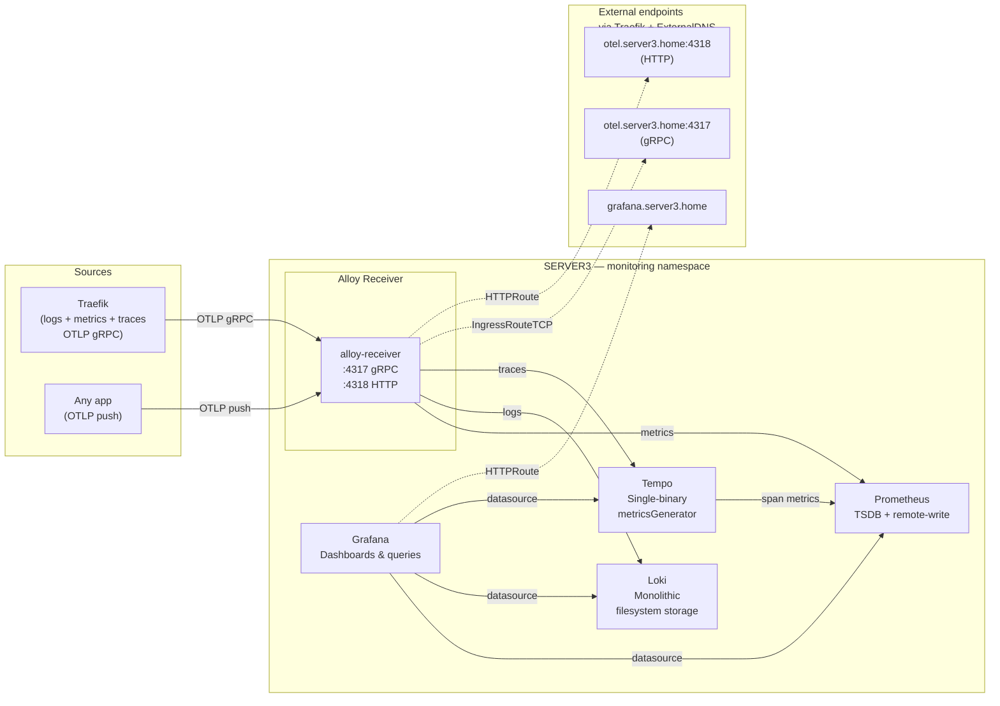

# Observability

Central LGTM stack deployed on **server3** only. Collects metrics, logs, and traces from all workloads via a single OpenTelemetry push endpoint. Grafana provides the unified query and dashboard UI.

## Architecture overview


```mermaid
graph LR
    subgraph Sources["Sources"]
        Traefik["Traefik<br/>(logs + metrics + traces<br/>OTLP gRPC)"]
        Apps["Any app<br/>(OTLP push)"]
    end

    subgraph Server3["SERVER3 — monitoring namespace"]
        subgraph Gateway["Alloy Receiver"]
            Alloy["alloy-receiver<br/>:4317 gRPC<br/>:4318 HTTP"]
        end
        
        Prometheus["Prometheus<br/>TSDB + remote-write"]
        Loki["Loki<br/>Monolithic<br/>filesystem storage"]
        Tempo["Tempo<br/>Single-binary<br/>metricsGenerator"]
        Grafana["Grafana<br/>Dashboards & queries"]
    end

    subgraph External["External endpoints<br/>via Traefik + ExternalDNS"]
        OTelGrpc["otel.server3.home:4317<br/>(gRPC)"]
        OTelHttp["otel.server3.home:4318<br/>(HTTP)"]
        GrafanaExt["grafana.server3.home"]
    end

    Traefik -->|OTLP gRPC| Alloy
    Apps -->|OTLP push| Alloy
    
    Alloy -->|metrics| Prometheus
    Alloy -->|logs| Loki
    Alloy -->|traces| Tempo
    
    Tempo -->|span metrics| Prometheus
    
    Grafana -->|datasource| Prometheus
    Grafana -->|datasource| Loki
    Grafana -->|datasource| Tempo
    
    Alloy -.->|IngressRouteTCP| OTelGrpc
    Alloy -.->|HTTPRoute| OTelHttp
    Grafana -.->|HTTPRoute| GrafanaExt
```

**Prometheus never scrapes.** Apps push OTLP to `alloy-receiver`; infrastructure metrics are scraped locally by the same Alloy collector on each cluster. Everything reaches server3 over a single outbound path per cluster — no kube-prometheus-stack, no Prometheus scrape configs.

## Components

| Component | Chart | Version location | Helm values |
|-----------|-------|------------------|-------------|
| k8s-monitoring (Grafana Alloy) | `grafana/k8s-monitoring` | [`apps/observability/K8sMonitoring.yaml`](../gitops/argocd-manifests/apps/observability/K8sMonitoring.yaml) `targetRevision` | [shared](../gitops/helm-values/k8s-monitoring.yaml) · [server1](../gitops/helm-values/server1/k8s-monitoring.yaml) · [server2](../gitops/helm-values/server2/k8s-monitoring.yaml) · [server3](../gitops/helm-values/server3/k8s-monitoring.yaml) |
| Prometheus | `prometheus-community/prometheus` | [`server3/apps/observability/Prometheus.yaml`](../gitops/argocd-manifests/server3/apps/observability/Prometheus.yaml) `targetRevision` | [shared](../gitops/helm-values/prometheus.yaml) · [server3](../gitops/helm-values/server3/prometheus.yaml) |
| Loki | `grafana-community/loki` | [`server3/apps/observability/Loki.yaml`](../gitops/argocd-manifests/server3/apps/observability/Loki.yaml) `targetRevision` | [shared](../gitops/helm-values/loki.yaml) |
| Tempo | `grafana-community/tempo` | [`server3/apps/observability/Tempo.yaml`](../gitops/argocd-manifests/server3/apps/observability/Tempo.yaml) `targetRevision` | [shared](../gitops/helm-values/tempo.yaml) |
| Grafana | `grafana-community/grafana` | [`server3/apps/observability/Grafana.yaml`](../gitops/argocd-manifests/server3/apps/observability/Grafana.yaml) `targetRevision` | [shared](../gitops/helm-values/grafana.yaml) · [server3](../gitops/helm-values/server3/grafana.yaml) |

All charts are deployed by ArgoCD. k8s-monitoring runs on all clusters (managed by the `K8sMonitoring` ApplicationSet under [`roots/RootObservability.yaml`](../gitops/argocd-manifests/roots/RootObservability.yaml)). The LGTM stack (Prometheus, Grafana, Loki, Tempo) is server3-only, managed by [`roots/server3/RootObservability.yaml`](../gitops/argocd-manifests/roots/server3/RootObservability.yaml).

## Internal service addresses

| Service | ClusterIP address | Port |
|---------|-------------------|------|
| Alloy Receiver (gRPC) | `k8s-monitoring-alloy-receiver.monitoring.svc.cluster.local` | 4317 |
| Alloy Receiver (HTTP) | `k8s-monitoring-alloy-receiver.monitoring.svc.cluster.local` | 4318 |
| Prometheus | `prometheus.monitoring.svc.cluster.local` | 80 |
| Loki | `loki.monitoring.svc.cluster.local` | 3100 |
| Tempo (gRPC) | `tempo.monitoring.svc.cluster.local` | 4317 |
| Tempo (HTTP) | `tempo.monitoring.svc.cluster.local` | 3200 |
| Grafana | `grafana.monitoring.svc.cluster.local` | 80 |

## k8s-monitoring signal flow

The `k8s-monitoring` Helm chart deploys Grafana Alloy as the single telemetry ingestion layer. The `alloy-receiver` DaemonSet accepts inbound OTLP from applications and remote clusters, and also handles all local scraping and log collection.

### Collectors — one collapsed instance

Chart v4 removed the built-in named Alloy instances. Collectors are declared under `collectors:` in the shared base, and each feature names the one it runs on. The chart's default layout is **four** collectors, one per role. This repo collapses them into **one**, which is safe only because every cluster is single-node.

| Collector | Presets | Features assigned |
|-----------|---------|-------------------|
| `alloy-receiver` (DaemonSet) | `daemonset`, `filesystem-log-reader`, `otel-receiver`, `clustered` | `applicationObservability`, `clusterMetrics`, `hostMetrics`, `clusterEvents`, `podLogsViaLoki` |

Collapsing loses no telemetry — identical features, scrapes, and data, just one Alloy process instead of four.

It keeps the name `alloy-receiver` on purpose. The Service is `k8s-monitoring-alloy-receiver`, referenced by every app's OTLP URL, [traefik.yaml](../gitops/helm-values/traefik.yaml), the HTTPRoute, and the IngressRouteTCP. Keeping the name means the OTLP endpoint is a stable contract whether the collectors are collapsed or split.

`clusterMetrics` requires the `clustered` preset — the chart refuses to render without it. At one replica it is a no-op.

#### Going multi-node: split the collectors back

The four-way split exists for reasons that apply **only** to multi-node clusters:

| Role | Why the chart splits it | Why it's moot on one node |
|------|-------------------------|---------------------------|
| logs | DaemonSet, reads local `/var/log` | DaemonSet == 1 pod |
| metrics | clustering shards scrape targets across replicas | nothing to shard |
| singleton | >1 replica duplicates k8s events | only ever 1 replica |
| receiver | scales independently with ingest volume | ingest is small |

Adding a second node to any cluster **without splitting** causes: k8s events emitted once per node (N duplicates in Loki), duplicated scrape targets, and a single OOM taking out all telemetry at once. The exact replacement block is in the header comment of [gitops/helm-values/k8s-monitoring.yaml](../gitops/helm-values/k8s-monitoring.yaml).

### Pod logs — Loki pipeline, not OpenTelemetry

Chart v4 split pod-log collection into `podLogsViaLoki` and `podLogsViaOpenTelemetry`. This repo uses `podLogsViaLoki` on **all** clusters: the OpenTelemetry variant needs `otelcol.receiver.filelog`, which is still public-preview in Alloy and requires lowering the collector's `stabilityLevel`. The Loki-format logs are bridged into an OTLP destination automatically via `otelcol.receiver.loki` — on server1/server2 that is the forwarding destination to server3, and on server3 it is the local Loki destination, which is now `type: otlp` as well. So pod logs are Loki-format only up to the bridge; everything reaches Loki as OTLP.

### Supplemental telemetry services

Chart v4 moved kube-state-metrics and node-exporter into the `telemetryServices` subchart, where every service defaults to `deploy: false`. Both are enabled in the shared base — `clusterMetrics` needs kube-state-metrics and `hostMetrics` needs node-exporter. `windows-exporter` stays off (all nodes are Talos Linux).

### Metric allow-lists

Each `clusterMetrics` scrape target is filtered by the chart's built-in allow-list (`useDefaultAllowList: true`, the default). Extend it with `metricsTuning.includeMetrics` — the chart **concatenates** the default list and the additions, so nothing already collected is dropped. Replacing `useDefaultAllowList` instead is the risky path and is not used here.

Two adjustments are in place, both in `gitops/helm-values/k8s-monitoring.yaml`, and both exist to make probe failure visible:

**`kube_pod_status_ready`** (added to the kube-state-metrics allow-list) — the chart default carries `kube_pod_status_phase`, `kube_pod_status_reason` and the container restart/waiting series, but not this one. The custom apps gate readiness on MongoDB/EMQX, so a dependency outage takes their pods out of the Service Endpoints while `phase` stays `Running` and `restarts_total` stays flat. Without this metric that outage changes nothing in Prometheus and no alert can fire.

**`kubeletProbes`** (enabled; off by default) — kubelet's own `prober_*` counters, scraped from `/metrics/probes` on each node. This is a **separate scrape target** from `kube-state-metrics`, but it reuses the node discovery, serviceaccount token and TLS config of the existing `kubelet` scrape, so it needs no extra RBAC. `kube_pod_status_ready` says a pod is NotReady; `prober_probe_total` says *which* probe failed. `probe_type="Readiness"` failing while `probe_type="Liveness"` stays clean is what proves the shallow-liveness/deep-readiness split is working. It also surfaces probe flapping that never reaches `failureThreshold`.

`prober_probe_duration_seconds` is excluded — a histogram costing roughly 7× the rest of `prober_*`, answering a question (probe latency) that only matters when tuning `timeoutSeconds`. Timeouts still appear in `prober_probe_total` as `result="failed"`. The exclusion is applied post-scrape in Alloy, so it saves storage and remote-write, not scrape work.

> `prober_probe_total` carries a `pod_uid` label, which is regenerated on every pod restart — series accumulate with churn instead of staying flat. If cardinality grows, drop it with a `labeldrop` rule under `kubeletProbes.extraMetricProcessingRules`.

No alerting consumes either metric yet; that is a separate piece of work pending a notification channel.

### server3 fan-out routing (local)

| Signal | Destination | Chart destination `type` |
|--------|-------------|--------------------------|
| metrics | `http://prometheus.monitoring…:80/api/v1/write` | `prometheus` |
| logs | `http://loki.monitoring…:3100/otlp` (native OTLP, `/v1/logs`) | `otlp` |
| traces | `tempo.monitoring…:4317` (OTLP gRPC) | `otlp` |

#### Why logs use `type: otlp`, not `type: loki`

`type: loki` renders `otelcol.exporter.loki` — Alloy's own converter, explicitly *"unrelated to the standard `lokiexporter`"*. Three behaviours are hardcoded in it, and every one is fatal here:

- the log line is **always** the JSON envelope `{"body":…,"attributes":…,"resources":…}`; Alloy's converter has no `loki.format` hint
- `StructuredMetadata` is **always** `nil` — every case in its `convert_test.go`
- only resource attributes named in the `loki.resource.labels` hint become labels; everything else is folded back into the line

Everything arriving over OTLP passed through it: Traefik's logs, the pod logs server1/server2 bridge over the wire, and any SDK logs. The result was a double-encoded line whose only structured metadata was Loki's own `detected_level` guess — which then read `unknown`, because an escaped `\"level\":\"info\"` inside the envelope defeats the heuristic.

Loki's native OTLP ingest does the right thing instead: body → log line, resource attributes → index labels, and severity / `trace_id` / `span_id` / scope / every log attribute → structured metadata. See Grafana's own [native OTLP vs Loki exporter](https://grafana.com/docs/loki/latest/send-data/otel/native_otlp_vs_loki_exporter) comparison.

This is not new. The pre-k8s-monitoring OTel gateway already exported to `:3100/otlp` (`394db38^:gitops/helm-values/server3/otel-gateway.yaml`, exporter `otlp_http/loki`); the migration to k8s-monitoring regressed it.

**There is deliberately no second `type: loki` destination.** It would split the label schema by cluster — server3's own scraped logs on Loki-native labels, server1/server2's on OTel labels — because server3 cannot tell a bridged pod log from an SDK log. Both arrive on the same `otelcol.receiver.otlp`, and the chart exposes no `otelcol.connector.routing`. One destination, one schema, all three clusters.

#### Two overrides the destination needs

**`clusterLabels: []`.** The default `[cluster, k8s.cluster.name]` renders an *unconditional* `set(attributes["cluster"], "server3")` into the destination's transform, which every log passes through — including logs from server1/server2 that already carry the correct value, stamped by their own destination transform. Under `type: loki` that stamp only reached `loki.write`'s `external_labels`, so it corrupted the label while leaving the resource attribute intact (the old data shows `k8s_cluster_name=server3` sitting over `resources.k8s.cluster.name=server1`). Under native OTLP the resource attribute *is* the label, so the unconditional set would relabel every cluster's logs as server3. Guarded OTTL in `processors.transform.logs.resource` replaces it, setting the value only when absent.

**`delete_key(attributes, "loki.resource.labels")`.** `applicationObservability` sets this hint on the **resource** context; the otlp destination's built-in cleanup only deletes it from the **log** context, so it survives. Harmless when `otelcol.exporter.loki` consumed it — but native OTLP ingest files anything it does not recognise as structured metadata, leaving a literal `loki_resource_labels="cluster, namespace, job, pod"` on every record.

#### Resulting log shape

Verified by POSTing a synthetic record to the live Loki 3.7.1 `/otlp/v1/logs` (HTTP 204):

| | |
|---|---|
| **line** | the log body, verbatim |
| **index labels** | `k8s_cluster_name`, `k8s_namespace_name`, `k8s_pod_name`, `k8s_container_name`, `service_name`, `service_namespace` — Loki's `default_resource_attributes_as_index_labels` |
| **structured metadata** | `severity_text`, `severity_number`, `detected_level`, `trace_id`, `span_id`, `scope_name`, `cluster`, `stream`, and every log attribute |

> **Label names changed.** Queries now use the OTel names (`k8s_pod_name`, `k8s_namespace_name`, `k8s_cluster_name`) rather than the Loki-native ones (`pod`, `namespace`, `cluster`). `cluster`, `container` and `stream` still exist as **structured metadata** — filterable with `| cluster = "server1"`, just not indexed. Accepted deliberately; the alternative is adding them to Loki's `distributor.otlp_config.default_resource_attributes_as_index_labels`.

> For logs the chart's `logToResource` map does the heavy lifting on the bridged Loki-format pod logs, promoting `pod`/`namespace`/`container`/`service_name`/`deployment`/`statefulset`/… into their `k8s.*` and `service.*` resource-attribute equivalents before they reach Loki. That is why scraped pod logs land with the same index labels as SDK logs.

### server1/server2 forwarding (OTLP to server3)

All signals are forwarded via a single OTLP destination to `otel.server3.home:4317`. The connection is **unauthenticated plaintext gRPC**.

> **Why there is no bearer token.** An earlier design sent one. It cannot work over this transport: gRPC refuses to attach per-RPC credentials to an insecure channel — `the credentials require transport level security` — so combining `tls.insecure: true` with `auth.type: bearerToken` stops the exporter from starting at all, and no telemetry leaves the cluster. Nothing is lost by dropping it, because server3's `alloy-receiver` never validated the token either: `k8s-monitoring` exposes no server-side OTLP auth. The endpoint has always relied on private-network isolation.
>
> To get real authentication, terminate TLS on `otel.server3.home` and then reinstate `tls.insecure: false` plus the `auth` block and `collectorCommon.alloy.envFrom`. The `otel-auth-token` ExternalSecret is left in place on server1/server2 for exactly that. Traefik ForwardAuth in front of `alloy-receiver` remains the alternative.

## Prometheus — TSDB only

Prometheus runs in TSDB mode with `--web.enable-remote-write-receiver`. No scraping is configured. All metrics arrive via Alloy remote-write or directly from Tempo's metricsGenerator.

The Helm release is named `prometheus` and `server.fullnameOverride: prometheus` is set so the Kubernetes Service is `prometheus.monitoring.svc.cluster.local:9090` (without the default `-server` suffix).

Sub-components disabled: **alertmanager** (Prometheus's built-in alert router — routes firing alerts to email, Slack, PagerDuty, etc.; unnecessary for a homelab with no on-call), kube-state-metrics, prometheus-node-exporter, prometheus-pushgateway.

Retention: **30 days**. Storage: 20 Gi Longhorn PVC.

## Loki — Monolithic mode

Loki runs as a single binary (Monolithic deployment mode). Receives logs from Alloy on port 3100 via the **native OTLP endpoint** (`/otlp/v1/logs`) — not the Loki push API; see [Why logs use `type: otlp`](#why-logs-use-type-otlp-not-type-loki). Uses filesystem storage backed by a 20 Gi Longhorn PVC.

Structured metadata is required and is on by default for schema v13 + TSDB. All ingest defaults are untouched, including `distributor.otlp_config.default_resource_attributes_as_index_labels` — that list is what determines which resource attributes become index labels, and Loki caps index labels at 15 (current usage: ~6).

Auth is disabled (`auth_enabled: false`). Schema v13 (TSDB store). Self-monitoring and canary pods are disabled.

> **Note:** Loki v13.x renamed `SingleBinary` to `Monolithic` as the `deploymentMode` value. The `singleBinary:` config key still controls replica count and persistence.

## Tempo — single-binary mode

Tempo stores traces locally at `/var/tempo/traces` with a 20 Gi Longhorn PVC and a **14-day** retention (`336h`).

**metricsGenerator** is enabled. It derives RED metrics (rate, error, duration) from incoming traces and remote-writes them to Prometheus. This produces `traces_*` metric series in Prometheus, which Grafana uses for the service graph and span metrics features.

## Grafana datasources and correlations

Datasources are provisioned automatically via ConfigMaps watched by the Grafana sidecar (label `grafana_datasource: "1"`). All ConfigMaps live in [gitops/k8s-manifests/server3/grafana/](../gitops/k8s-manifests/server3/grafana/). Pre-shipped dashboards (label `grafana_dashboard: "1"`) are also loaded from the same directory — currently [`ConfigMap.grafana.dashboard.traefik-opentelemetry.yaml`](../gitops/k8s-manifests/server3/grafana/ConfigMap.grafana.dashboard.traefik-opentelemetry.yaml).

| Datasource | UID | URL |
|------------|-----|-----|
| Prometheus | `prometheus` | `http://prometheus.monitoring.svc.cluster.local` (port 80, default) |
| Loki | `loki` | `http://loki.monitoring.svc.cluster.local:3100` |
| Tempo | `tempo` | `http://tempo.monitoring.svc.cluster.local:3200` |

### Cross-datasource correlations configured

- **Traces → Logs** (`tracesToLogsV2`): Tempo links to Loki with a `customQuery` filtering the **structured-metadata** field — `{k8s_cluster_name=~".+"} | trace_id = "$${__span.traceId}"`. `filterByTraceID` is off: it appends a *line* filter (`|= "<traceID>"`), and since logs moved to Loki's native OTLP ingest the trace ID is structured metadata, not text in the line, so that filter matches nothing.
- **Traces → Metrics** (`tracesToMetrics`): Tempo links to Prometheus `traces_spanmetrics_*` series (from metricsGenerator).
- **Service graph** (`serviceMap`): Tempo service graph queries Prometheus for topology.
- **Logs → Traces** (`derivedFields`): Loki links to Tempo via `matcherType: label` on `trace_id` — again structured metadata, so the previous `matcherRegex: "trace_id=(\w+)"` line scan no longer applies.
- **Node graph**: enabled on Tempo datasource.

> Both directions depend on `trace_id` being structured metadata. Anything that puts logs back on the Loki push API breaks both.

## Grafana admin credentials

Admin credentials are stored in OpenBao and synced to the `monitoring` namespace via ExternalSecret ([ExternalSecret.grafana.admin.yaml](../gitops/k8s-manifests/server3/grafana/ExternalSecret.grafana.admin.yaml)).

| OpenBao path | Key | Maps to |
|---|---|---|
| `secret/server3/grafana` | `admin-user` | `grafana-admin` Secret → `.admin-user` |
| `secret/server3/grafana` | `admin-password` | `grafana-admin` Secret → `.admin-password` |

Seed command (run before applying RootObservability):

```bash
bao kv put secret/server3/grafana admin-user=admin admin-password=<strong-password>
```

## Traefik integration

Traefik pushes **traces and metrics** via OTLP gRPC to `alloy-receiver`. Logs are no longer pushed over OTLP — Traefik writes them to stdout and Alloy collects them via `podLogsViaLoki`, so `logs.*.otlp` and `experimental.otlpLogs` were removed.

```yaml
# gitops/helm-values/traefik.yaml  (shared — all clusters)
logs:
  general:
    level: INFO
  access:
    enabled: true

tracing:
  otlp:
    grpc:
      endpoint: "k8s-monitoring-alloy-receiver.monitoring.svc.cluster.local:4317"
      insecure: true

metrics:
  otlp:
    addEntryPointsLabels: true
    addRoutersLabels: true
    addServicesLabels: true
    grpc:
      endpoint: "k8s-monitoring-alloy-receiver.monitoring.svc.cluster.local:4317"
      insecure: true
```

- **Traces** appear in Tempo and are linked to application-level spans via the `traceparent` header.
- **Metrics** (per-entrypoint, per-router, per-service) appear in Prometheus under the `traefik_*` namespace.
- **Logs** (general + access) appear in Loki via Alloy pod-log collection — no Traefik-side OTLP config required.

## Sending telemetry from an application

### From server1 / server2 (external)

Two external endpoints are exposed via Traefik on server3:

| Protocol | Endpoint | Traefik route |
|----------|----------|---------------|
| OTLP HTTP | `http://otel.server3.home` | HTTPRoute (Traefik port 80) → backend port 4318 |
| OTLP gRPC | `otel.server3.home:4317` | IngressRouteTCP → backend port 4317 |

The gRPC endpoint uses raw TCP passthrough (`HostSNI(*)`), so no TLS is required from the client.

### From server3 (in-cluster)

Use the ClusterIP address directly — no Traefik hop needed:

```
OTLP HTTP:  http://k8s-monitoring-alloy-receiver.monitoring.svc.cluster.local:4318
OTLP gRPC:  k8s-monitoring-alloy-receiver.monitoring.svc.cluster.local:4317
```

All three signal types (metrics, logs, traces) are accepted on both endpoints.

### Custom apps push all three signals, logs included

The Node.js APIs set `otel.logs.enabled: true` in their config templates — one `"logs"` block per app per environment, in `gitops/helm-values/apps/<app>/{production,sandbox}.yaml`, pointing at `k8s-monitoring-alloy-receiver…:4318/v1/logs`. The ConfigMap is mounted, and each app carries `reloader.stakater.com/auto: "true"`, so Reloader restarts the pod on change.

It was `true` until `394db38` (the k8s-monitoring migration) turned it off, on the reasoning that Winston already writes to stdout and `podLogsViaLoki` ships that to Loki, so OTLP export would only duplicate. That reasoning held only because the destination was `type: loki`, which flattened OTLP logs into an unreadable JSON envelope — so the OTLP copy was strictly worse than the scraped one. With Loki's native OTLP endpoint the ordering reverses:

| | scraped stdout | SDK OTLP |
|---|---|---|
| line | the whole Winston JSON blob | `message`, readable |
| `level` | text inside the blob | `severityText`/`severityNumber` → structured metadata |
| `trace_id`/`span_id` | text inside the blob | native LogRecord fields → structured metadata |
| other Winston fields | text inside the blob | log attributes → structured metadata |
| Resource attributes | absent — must be reconstructed from `resource.opentelemetry.io/*` podAnnotations | `service.name`, `service.version`, `process.*`, `host.*`, `telemetry.sdk.*` all present — the few in Loki's default list (`service.name`, `service.namespace`, `service.instance.id`) become index labels, the rest structured metadata |
| timestamp | kubelet's read time | the record's own |

`@opentelemetry/winston-transport`'s `emitLogRecord()` is what does it: `message` → body, `level` → severity, **every other field** → attributes, with exceptions mapped to `exception.type`/`message`/`stacktrace`.

**Pod-log scraping is still on for these apps, so every line is currently stored twice.** That overlap is deliberate — it is the safe state while confirming OTLP logs actually arrive. See open item 2 for the opt-out that ends it, and for why you may decide to keep the overlap.

The reasons stdout was the primary path have not gone away, and they are what the opt-out decision turns on:

1. **`kubectl logs` keeps working.** Independent of this setting — Winston still writes stdout regardless; only the *collection* of it is opt-out-able.
2. **Crash coverage.** OTLP export loses anything emitted before the exporter initializes, plus OOMKills, unhandled exceptions at exit, and whatever sits in the batch buffer when a pod is killed. The kubelet writes pod logs to disk, so they survive all of it — including an Alloy outage. This is the real cost of opting out of scraping, and it bites exactly when you most need logs.
3. **No duplication.** Currently violated, by design, until the opt-out lands.

#### Open items (deferred)

**1. Restore resource attributes as Loki labels — for scraped pods only.** Relevant to any workload whose logs are collected from stdout; a workload that adopts SDK export (item 2) carries its full Resource on the record already and needs none of this. No chart change needed — the rendered pod-logs pipeline already contains a generic labelmap:

```
rule {
  action = "labelmap"
  regex = "__meta_kubernetes_pod_annotation_resource_opentelemetry_io_(.+)"
}
```

Any `resource.opentelemetry.io/*` pod annotation becomes a Loki label, and the `service_name` detection chain checks `resource.opentelemetry.io/service.name` before falling back to the `app.kubernetes.io/name` label and then the container name. So this is purely additive on the app side:

```yaml
podAnnotations:
  resource.opentelemetry.io/service.name: qr-manager-api
  resource.opentelemetry.io/service.version: "0.2.1"
  resource.opentelemetry.io/service.namespace: iot
```

`service.version` is worth templating from `image.tag` in the iot-applications chart rather than maintaining by hand.

**2. Decide whether to stop scraping the custom APIs' stdout.** `otel.logs.enabled: true` is now set for all three APIs in both environments, so their logs arrive over OTLP *and* are still scraped from stdout — every line is stored twice. Sequencing:

1. ~~Enable the Winston OTLP transport in each app (`otel.logs.enabled`).~~ Done — all six `{production,sandbox}.yaml` config templates.
2. **Confirm the logs arrive over OTLP.** The two copies are easy to tell apart: the OTLP record's line is just `message` and it carries `severity_text`/`severity_number` in structured metadata, while the scraped copy's line is the whole Winston JSON blob and carries `stream` and `flags` instead. (`service_version` is *not* an index label — `service.version` is absent from Loki's default list, so it lands in structured metadata too.)
3. *Then* decide on the opt-out — the chart's drop rule applies regardless of `discoveryMethod`:

```yaml
podAnnotations:
  logs.grafana.com/pods.enabled: "false"
```

> **Do not add that annotation before step 2 succeeds** — it deletes the scraped copy, and if OTLP export is not actually working that is all the logs.

Step 3 is a genuine trade, not a cleanup. Opting out halves storage and removes the duplicate, but SDK export cannot cover boot failures before the exporter initializes, OOMKills, or whatever sits in the batch buffer when a pod is killed — the cases where logs matter most. Keeping both is a defensible permanent choice; the duplicate is the premium paid for crash coverage.

**3. JSON-on-stdout parsing — only for workloads that never adopt SDK export.** If some app keeps logging JSON to stdout, the line can be parsed at collection instead, in `podLogsViaLoki`:

```yaml
extraLogProcessingStages: |-
  stage.json {
    expressions = { level = "level", trace_id = "trace_id", span_id = "span_id" }
  }
structuredMetadata:
  level: level
  trace_id: trace_id
  span_id: span_id
```

`stage.json` extracts nothing and passes the line through unchanged when it isn't JSON, so plain-text startup banners and stack traces are safe. This is strictly a fallback — it duplicates by hand what the SDK does natively, and it is per-field.

## Helm values — two-layer structure

```
gitops/helm-values/k8s-monitoring.yaml           ← shared base: feature toggles, no destinations
gitops/helm-values/<cluster>/k8s-monitoring.yaml ← cluster name + destinations
```

Both files are applied on every cluster. The shared base carries only the feature toggles (`clusterMetrics`, `hostMetrics`, `podLogs`, `clusterEvents`, `applicationObservability`) and the four Alloy collector roles — never a `destinations` entry, since those are entirely cluster-specific. LGTM backend apps (Prometheus, Grafana, Loki, Tempo) run only on server3.

## ArgoCD deployment structure

```
gitops/argocd-manifests/
  roots/
    RootObservability.yaml                     ← sync-wave "3" — App-of-Apps for all clusters
    server3/
      RootObservability.yaml                   ← sync-wave "3" — App-of-Apps for server3 LGTM stack
  apps/observability/
    K8sMonitoring.yaml                         ← k8s-monitoring chart + k8s-manifests/<cluster>/k8s-monitoring (AppSet, all clusters)
  server3/apps/observability/
    Prometheus.yaml                            ← prometheus chart
    Loki.yaml                                  ← loki chart
    Tempo.yaml                                 ← tempo chart
    Grafana.yaml                               ← grafana chart + ExternalSecret + datasource ConfigMaps + HTTPRoute
```

Both Root Applications are discovered by the meta [`Bootstrap.yaml`](../gitops/argocd-manifests/Bootstrap.yaml) (`directory.recurse: true` over `roots/`). No manual `kubectl apply` of Root Applications — the single `Bootstrap.yaml` apply on server3 owns them.

Sync-waves inside each Application guarantee ordering:
- wave `-50`: ExternalSecret + datasource ConfigMaps (must exist before Grafana starts)
- wave `100`: HTTPRoutes + IngressRouteTCP (Traefik must be running before routes bind)

## Deploying / bootstrapping

Handled end-to-end by the server3 Bootstrap flow — no observability-specific manual steps beyond seeding secrets.

Prerequisites before the `RootObservability` waves sync:

1. Seed Grafana admin secret: `bao kv put secret/server3/grafana admin-user=admin admin-password=<…>` (see [secrets.md](secrets.md)).
2. Seed shared OTLP bearer token: `bao kv put secret/otel-gateway/auth-token token=$(openssl rand -base64 32 | tr -d '=+/')`. server1/server2 k8s-monitoring reads this path via ESO into the `otel-auth-token` secret; server3 does not need it. Their ESO policies must include a read grant for `secret/otel-gateway/*` (see [iac.md](iac.md) step 3.d).
3. Ensure `RootGateway` (wave 2) has finished — Traefik is up so HTTPRoutes bind.

After that, `RootObservability` and `server3/RootObservability` sync automatically in wave 3 via `Bootstrap.yaml`. No standalone applies.

## Design decisions

### Why no kube-prometheus-stack?

kube-prometheus-stack bundles Prometheus Operator, Alertmanager, node-exporter, kube-state-metrics, and dozens of default alerting rules. For a homelab with no on-call requirements and a push-only pipeline, this is unnecessary complexity. The standalone `prometheus-community/prometheus` chart gives a bare TSDB without the operator machinery.

### Why Prometheus never scrapes directly

Prometheus itself has no scrape configs and no network path to remote clusters. Scraping is done **locally on each cluster by Alloy** (kube-state-metrics, node-exporter, ServiceMonitor/PodMonitor discovery), which then remote-writes into Prometheus on server3. Apps still push OTLP to `alloy-receiver`. Everything reaches Prometheus over a single outbound path per cluster — no firewall rules for Prometheus to reach back into server1/server2.

### Why k8s-monitoring instead of a standalone OTel Collector?

The `grafana/k8s-monitoring` chart deploys Grafana Alloy with pre-built configurations for cluster metrics, host metrics, pod logs, cluster events, and OTLP reception. This replaces both the otel-gateway (central OTLP ingestion) and the per-namespace Apps OTel Collector forwarders with a single chart deployment per cluster. Infrastructure telemetry (node/pod metrics, logs, events) comes for free without additional configuration.

### Why server3 only (not multi-cluster)?

The LGTM stack is intentionally centralised. All clusters push telemetry to server3 over the LAN. Running Prometheus/Loki/Tempo replicas on every cluster would fragment data and multiply storage requirements. Future multi-cluster support (e.g. Thanos, Grafana Alloy agents) can be added incrementally without restructuring the current single-hub design.
